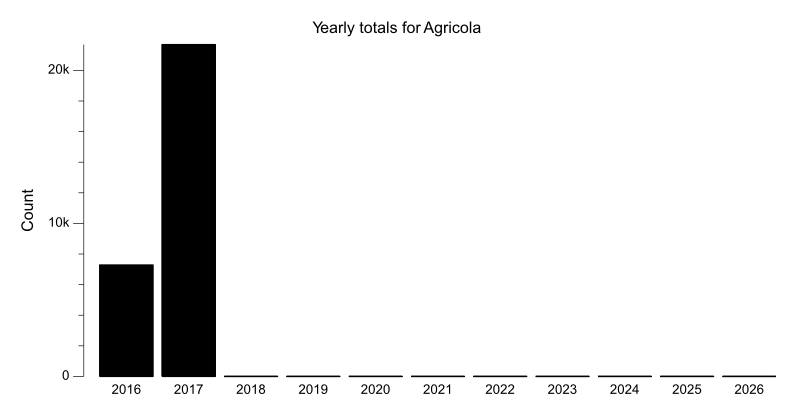
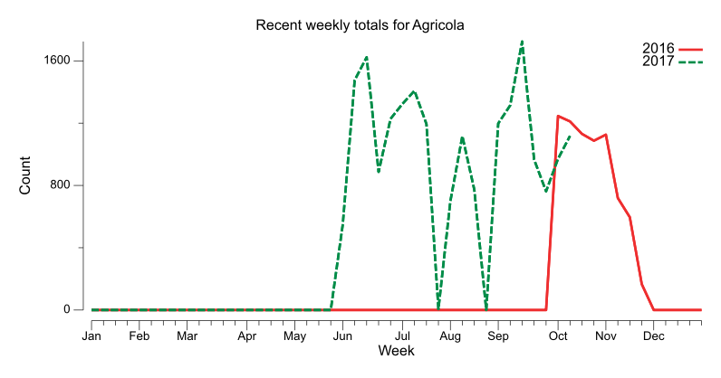
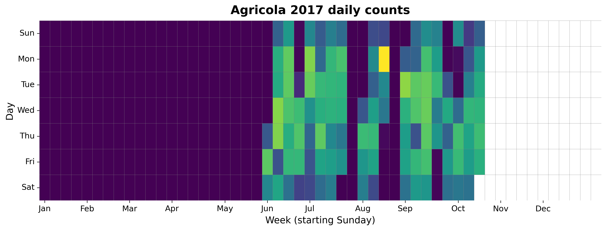
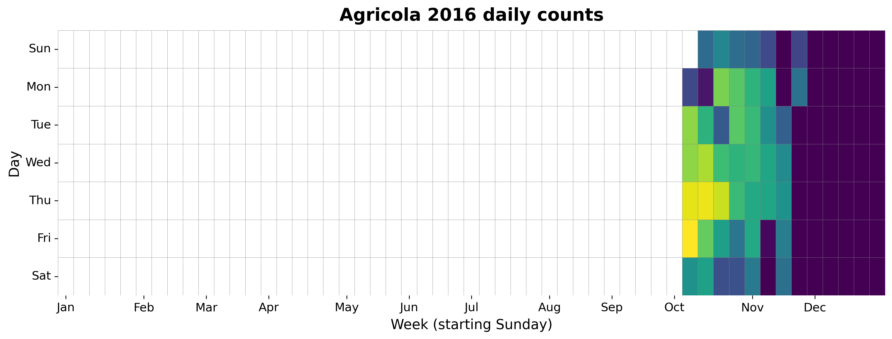

{
  "title": "Agricola",
  "type": "bikehfxstats-site",
  "as_of": "2026-08-17",
  "counter_id": "agricola",
  "location": "Agricola St just south of Charles St",
  "last_seen": "2017-10-31",
  "last_non_zero_seen": "2017-10-28",
  "total_all_time": 28871,
  "recent_day": {
    "label": "Aug 17",
    "count": 0
  },
  "recent_seven_days": {
    "label": "Trailing 7 days",
    "count": 0
  },
  "month_to_date": {
    "label": "Aug to date",
    "count": 0
  },
  "top_days": [
    {
      "label": "2017-08-14",
      "count": 367
    },
    {
      "label": "2017-08-29",
      "count": 304
    },
    {
      "label": "2017-06-07",
      "count": 301
    },
    {
      "label": "2017-06-08",
      "count": 298
    },
    {
      "label": "2017-06-26",
      "count": 297
    },
    {
      "label": "2016-10-07",
      "count": 287
    },
    {
      "label": "2017-09-13",
      "count": 283
    },
    {
      "label": "2017-09-12",
      "count": 282
    },
    {
      "label": "2017-06-27",
      "count": 281
    },
    {
      "label": "2016-10-13",
      "count": 279
    }
  ],
  "top_weeks": [
    {
      "label": "2017-09-10",
      "count": 1724
    },
    {
      "label": "2017-06-11",
      "count": 1623
    },
    {
      "label": "2017-06-04",
      "count": 1476
    },
    {
      "label": "2017-07-09",
      "count": 1408
    },
    {
      "label": "2017-10-15",
      "count": 1327
    },
    {
      "label": "2017-07-02",
      "count": 1324
    },
    {
      "label": "2017-09-03",
      "count": 1314
    },
    {
      "label": "2016-10-02",
      "count": 1246
    },
    {
      "label": "2017-06-25",
      "count": 1228
    },
    {
      "label": "2016-10-09",
      "count": 1211
    }
  ],
  "top_months": [
    {
      "label": "2017-06",
      "count": 5680
    },
    {
      "label": "2017-09",
      "count": 5116
    },
    {
      "label": "2016-10",
      "count": 4954
    },
    {
      "label": "2017-07",
      "count": 4013
    },
    {
      "label": "2017-10",
      "count": 3440
    },
    {
      "label": "2017-08",
      "count": 3436
    },
    {
      "label": "2016-11",
      "count": 2328
    }
  ],
  "year_heatmaps": [
    {
      "year": 2017,
      "filename": "heatmap-2017.png"
    },
    {
      "year": 2016,
      "filename": "heatmap-2016.png"
    }
  ],
  "charts": {
    "recent_weekly": "count-by-week-recent-years.png",
    "year_heatmap_2016": "heatmap-2016.png",
    "year_heatmap_2017": "heatmap-2017.png",
    "yearly_totals": "count-by-year.png"
  }
}

Data through 2026-08-17.

## Summary

- Total in 2026: 0
- Total all-time: 28871
- Active: false
- Last seen: 2017-10-31
- Last non-zero count: 2017-10-28
- Location: Agricola St just south of Charles St

## Yearly Totals

## Recent Weekly Trend

## 2017 Daily Heatmap

## 2016 Daily Heatmap

## Top Days

| Day | Count |
|---|---:|
| 2017-08-14 | 367 |
| 2017-08-29 | 304 |
| 2017-06-07 | 301 |
| 2017-06-08 | 298 |
| 2017-06-26 | 297 |
| 2016-10-07 | 287 |
| 2017-09-13 | 283 |
| 2017-09-12 | 282 |
| 2017-06-27 | 281 |
| 2016-10-13 | 279 |

## Top Weeks

| Week Starting | Count |
|---|---:|
| 2017-09-10 | 1724 |
| 2017-06-11 | 1623 |
| 2017-06-04 | 1476 |
| 2017-07-09 | 1408 |
| 2017-10-15 | 1327 |
| 2017-07-02 | 1324 |
| 2017-09-03 | 1314 |
| 2016-10-02 | 1246 |
| 2017-06-25 | 1228 |
| 2016-10-09 | 1211 |

## Top Months

| Month | Count |
|---|---:|
| 2017-06 | 5680 |
| 2017-09 | 5116 |
| 2016-10 | 4954 |
| 2017-07 | 4013 |
| 2017-10 | 3440 |
| 2017-08 | 3436 |
| 2016-11 | 2328 |
