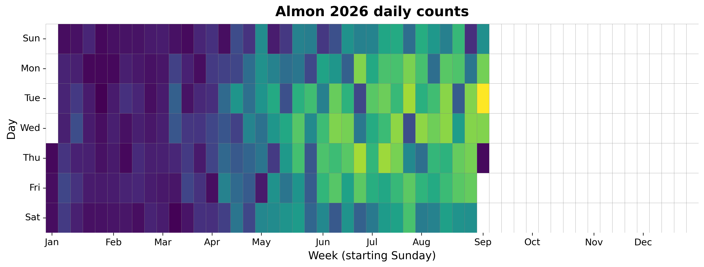
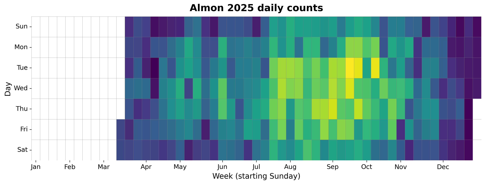

{
  "title": "Almon",
  "type": "bikehfxstats-site",
  "as_of": "2026-09-02",
  "counter_id": "almon",
  "active": true,
  "location": "Both sides of Almon St at the western edge of Richmond Yards",
  "last_seen": "2026-09-03",
  "last_non_zero_seen": "2026-09-02",
  "total_year": 44164,
  "total_all_time": 95860,
  "recent_day": {
    "label": "Sep 2",
    "count": 411
  },
  "recent_seven_days": {
    "label": "Trailing 7 days",
    "count": 2584
  },
  "month_to_date": {
    "label": "Sep to date",
    "count": 911
  },
  "top_days": [
    {
      "label": "2026-09-01",
      "count": 504
    },
    {
      "label": "2026-06-25",
      "count": 437
    },
    {
      "label": "2026-07-21",
      "count": 435
    },
    {
      "label": "2026-07-09",
      "count": 431
    },
    {
      "label": "2026-07-29",
      "count": 418
    },
    {
      "label": "2026-07-15",
      "count": 418
    },
    {
      "label": "2026-08-12",
      "count": 417
    },
    {
      "label": "2026-08-11",
      "count": 415
    },
    {
      "label": "2026-08-26",
      "count": 410
    },
    {
      "label": "2026-09-02",
      "count": 409
    }
  ],
  "top_weeks": [
    {
      "label": "2026-07-12",
      "count": 2449
    },
    {
      "label": "2026-07-05",
      "count": 2400
    },
    {
      "label": "2026-08-09",
      "count": 2375
    },
    {
      "label": "2025-09-14",
      "count": 2174
    },
    {
      "label": "2026-08-16",
      "count": 2142
    },
    {
      "label": "2026-07-26",
      "count": 2124
    },
    {
      "label": "2026-08-23",
      "count": 2119
    },
    {
      "label": "2026-07-19",
      "count": 2104
    },
    {
      "label": "2025-09-21",
      "count": 2080
    },
    {
      "label": "2026-06-28",
      "count": 2061
    }
  ],
  "top_months": [
    {
      "label": "2026-07",
      "count": 10026
    },
    {
      "label": "2026-08",
      "count": 9545
    },
    {
      "label": "2025-09",
      "count": 8723
    },
    {
      "label": "2026-06",
      "count": 8686
    },
    {
      "label": "2025-08",
      "count": 8143
    },
    {
      "label": "2025-07",
      "count": 7497
    },
    {
      "label": "2025-10",
      "count": 7121
    },
    {
      "label": "2026-05",
      "count": 6526
    },
    {
      "label": "2025-06",
      "count": 4922
    },
    {
      "label": "2026-04",
      "count": 4497
    }
  ],
  "year_heatmaps": [
    {
      "year": 2026,
      "filename": "heatmap-2026.png"
    },
    {
      "year": 2025,
      "filename": "heatmap-2025.png"
    }
  ],
  "charts": {
    "recent_weekly": "count-by-week-recent-years.png",
    "year_heatmap_2025": "heatmap-2025.png",
    "year_heatmap_2026": "heatmap-2026.png",
    "yearly_totals": "count-by-year.png"
  }
}

Data through 2026-09-02.

## Summary

- Total in 2026: 44164
- Total all-time: 95860
- Active: true
- Last seen: 2026-09-03
- Last non-zero count: 2026-09-02
- Location: Both sides of Almon St at the western edge of Richmond Yards

## Yearly Totals

## Recent Weekly Trend

## 2026 Daily Heatmap

## 2025 Daily Heatmap

## Top Days

| Day | Count |
|---|---:|
| 2026-09-01 | 504 |
| 2026-06-25 | 437 |
| 2026-07-21 | 435 |
| 2026-07-09 | 431 |
| 2026-07-29 | 418 |
| 2026-07-15 | 418 |
| 2026-08-12 | 417 |
| 2026-08-11 | 415 |
| 2026-08-26 | 410 |
| 2026-09-02 | 409 |

## Top Weeks

| Week Starting | Count |
|---|---:|
| 2026-07-12 | 2449 |
| 2026-07-05 | 2400 |
| 2026-08-09 | 2375 |
| 2025-09-14 | 2174 |
| 2026-08-16 | 2142 |
| 2026-07-26 | 2124 |
| 2026-08-23 | 2119 |
| 2026-07-19 | 2104 |
| 2025-09-21 | 2080 |
| 2026-06-28 | 2061 |

## Top Months

| Month | Count |
|---|---:|
| 2026-07 | 10026 |
| 2026-08 | 9545 |
| 2025-09 | 8723 |
| 2026-06 | 8686 |
| 2025-08 | 8143 |
| 2025-07 | 7497 |
| 2025-10 | 7121 |
| 2026-05 | 6526 |
| 2025-06 | 4922 |
| 2026-04 | 4497 |
