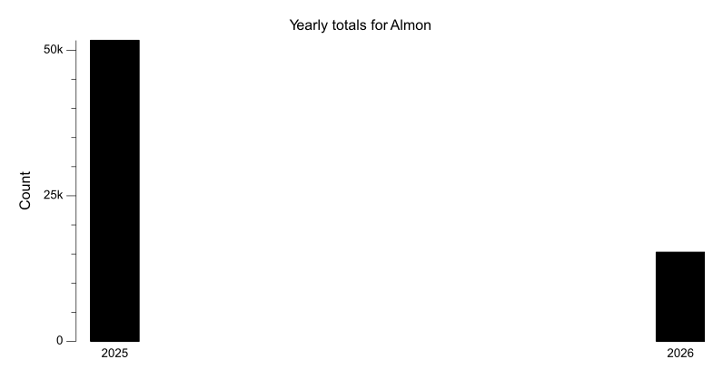
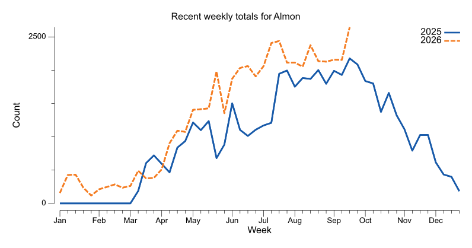
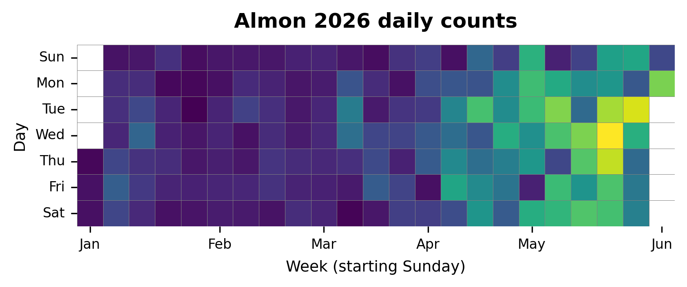

{
  "title": "Almon",
  "type": "bikehfxstats-site",
  "as_of": "2026-06-01",
  "counter_id": "almon",
  "active": true,
  "location": "Both sides of Almon St at the western edge of Richmond Yards",
  "last_seen": "2026-06-02",
  "last_non_zero_seen": "2026-06-01",
  "total_year": 15286,
  "total_all_time": 66982,
  "recent_day": {
    "label": "Jun 1",
    "count": 299
  },
  "recent_seven_days": {
    "label": "Trailing 7 days",
    "count": 1411
  },
  "month_to_date": {
    "label": "Jun to date",
    "count": 299
  },
  "top_days": [
    {
      "label": "2025-09-16",
      "count": 400
    },
    {
      "label": "2025-10-07",
      "count": 386
    },
    {
      "label": "2025-09-23",
      "count": 382
    },
    {
      "label": "2025-09-17",
      "count": 378
    },
    {
      "label": "2025-09-04",
      "count": 372
    },
    {
      "label": "2026-05-20",
      "count": 371
    },
    {
      "label": "2025-09-25",
      "count": 361
    },
    {
      "label": "2026-05-21",
      "count": 354
    },
    {
      "label": "2025-09-03",
      "count": 353
    },
    {
      "label": "2025-07-23",
      "count": 352
    }
  ],
  "top_weeks": [
    {
      "label": "2025-09-14",
      "count": 2174
    },
    {
      "label": "2025-09-21",
      "count": 2080
    },
    {
      "label": "2026-05-17",
      "count": 1997
    },
    {
      "label": "2025-08-31",
      "count": 1997
    },
    {
      "label": "2025-08-17",
      "count": 1997
    },
    {
      "label": "2025-07-20",
      "count": 1982
    },
    {
      "label": "2025-07-13",
      "count": 1942
    },
    {
      "label": "2025-09-07",
      "count": 1930
    },
    {
      "label": "2025-08-03",
      "count": 1886
    },
    {
      "label": "2025-08-10",
      "count": 1873
    }
  ],
  "top_months": [
    {
      "label": "2025-09",
      "count": 8723
    },
    {
      "label": "2025-08",
      "count": 8143
    },
    {
      "label": "2025-07",
      "count": 7497
    },
    {
      "label": "2025-10",
      "count": 7121
    },
    {
      "label": "2026-05",
      "count": 6526
    },
    {
      "label": "2025-06",
      "count": 4922
    },
    {
      "label": "2026-04",
      "count": 4497
    },
    {
      "label": "2025-05",
      "count": 4428
    },
    {
      "label": "2025-11",
      "count": 4165
    },
    {
      "label": "2025-04",
      "count": 3380
    }
  ],
  "charts": {
    "recent_weekly": "count-by-week-recent-years.png",
    "year_heatmap": "heatmap.png",
    "yearly_totals": "count-by-year.png"
  }
}

Data through 2026-06-01.

## Summary

- Total in 2026: 15286
- Total all-time: 66982
- Active: true
- Last seen: 2026-06-02
- Last non-zero count: 2026-06-01
- Location: Both sides of Almon St at the western edge of Richmond Yards

## Yearly Totals

## Recent Weekly Trend

## 2026 Daily Heatmap

## Top Days

| Day | Count |
|---|---:|
| 2025-09-16 | 400 |
| 2025-10-07 | 386 |
| 2025-09-23 | 382 |
| 2025-09-17 | 378 |
| 2025-09-04 | 372 |
| 2026-05-20 | 371 |
| 2025-09-25 | 361 |
| 2026-05-21 | 354 |
| 2025-09-03 | 353 |
| 2025-07-23 | 352 |

## Top Weeks

| Week Starting | Count |
|---|---:|
| 2025-09-14 | 2174 |
| 2025-09-21 | 2080 |
| 2026-05-17 | 1997 |
| 2025-08-31 | 1997 |
| 2025-08-17 | 1997 |
| 2025-07-20 | 1982 |
| 2025-07-13 | 1942 |
| 2025-09-07 | 1930 |
| 2025-08-03 | 1886 |
| 2025-08-10 | 1873 |

## Top Months

| Month | Count |
|---|---:|
| 2025-09 | 8723 |
| 2025-08 | 8143 |
| 2025-07 | 7497 |
| 2025-10 | 7121 |
| 2026-05 | 6526 |
| 2025-06 | 4922 |
| 2026-04 | 4497 |
| 2025-05 | 4428 |
| 2025-11 | 4165 |
| 2025-04 | 3380 |
