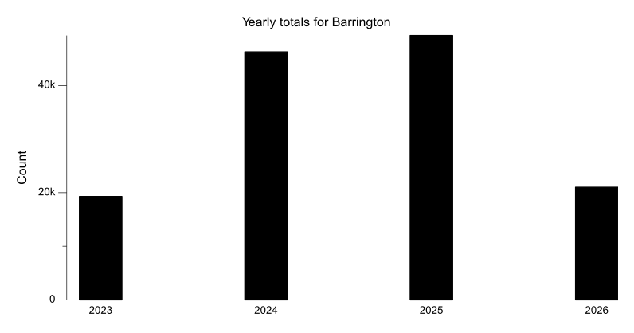
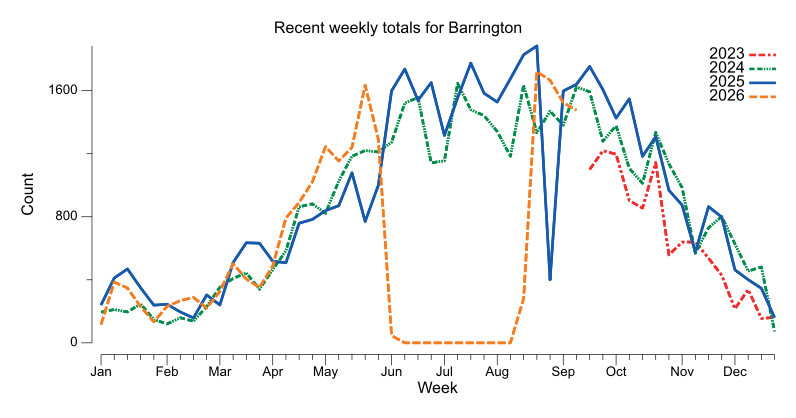
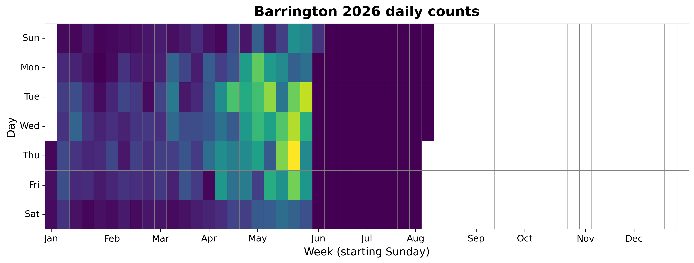
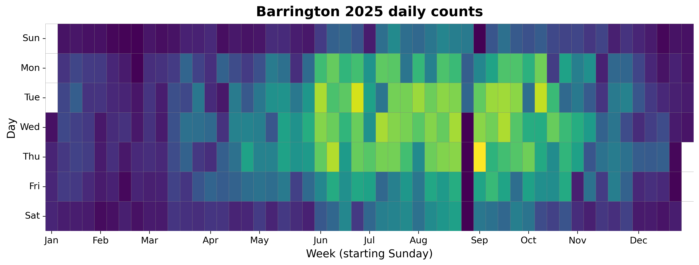
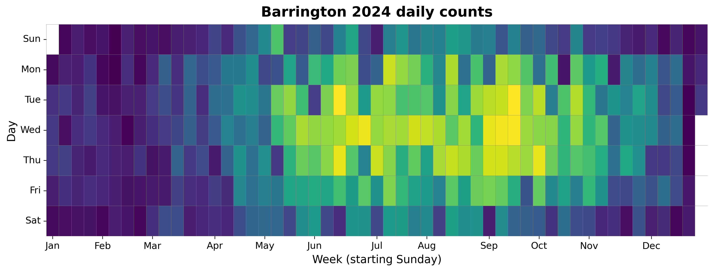
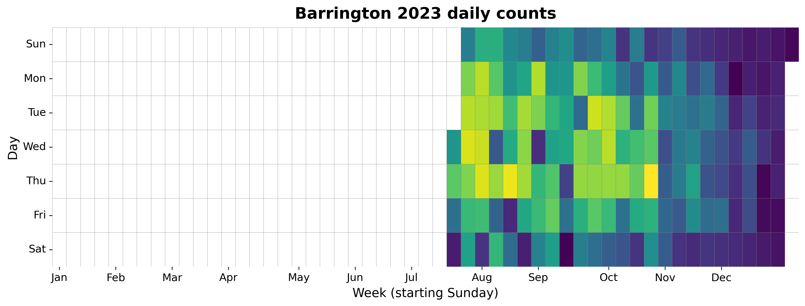

{
  "title": "Barrington",
  "type": "bikehfxstats-site",
  "as_of": "2026-08-04",
  "counter_id": "barrington",
  "active": true,
  "location": "Just south of North St",
  "last_seen": "2026-05-31",
  "last_non_zero_seen": "2026-05-31",
  "total_year": 13520,
  "total_all_time": 128408,
  "recent_day": {
    "label": "Aug 4",
    "count": 0
  },
  "recent_seven_days": {
    "label": "Trailing 7 days",
    "count": 0
  },
  "month_to_date": {
    "label": "Aug to date",
    "count": 0
  },
  "top_days": [
    {
      "label": "2025-09-04",
      "count": 395
    },
    {
      "label": "2025-06-24",
      "count": 370
    },
    {
      "label": "2026-05-21",
      "count": 359
    },
    {
      "label": "2025-10-07",
      "count": 358
    },
    {
      "label": "2025-06-12",
      "count": 350
    },
    {
      "label": "2025-09-17",
      "count": 346
    },
    {
      "label": "2025-06-03",
      "count": 345
    },
    {
      "label": "2025-07-09",
      "count": 343
    },
    {
      "label": "2025-08-20",
      "count": 341
    },
    {
      "label": "2025-09-16",
      "count": 339
    }
  ],
  "top_weeks": [
    {
      "label": "2025-08-17",
      "count": 1887
    },
    {
      "label": "2025-08-10",
      "count": 1829
    },
    {
      "label": "2025-07-13",
      "count": 1772
    },
    {
      "label": "2025-09-14",
      "count": 1751
    },
    {
      "label": "2025-06-08",
      "count": 1730
    },
    {
      "label": "2025-08-03",
      "count": 1687
    },
    {
      "label": "2025-06-22",
      "count": 1657
    },
    {
      "label": "2025-09-07",
      "count": 1645
    },
    {
      "label": "2026-05-17",
      "count": 1635
    },
    {
      "label": "2024-08-11",
      "count": 1631
    }
  ],
  "top_months": [
    {
      "label": "2025-07",
      "count": 7202
    },
    {
      "label": "2025-09",
      "count": 7089
    },
    {
      "label": "2025-06",
      "count": 6758
    },
    {
      "label": "2024-07",
      "count": 6544
    },
    {
      "label": "2024-08",
      "count": 6115
    },
    {
      "label": "2025-08",
      "count": 6112
    },
    {
      "label": "2024-09",
      "count": 6089
    },
    {
      "label": "2025-10",
      "count": 5886
    },
    {
      "label": "2024-06",
      "count": 5687
    },
    {
      "label": "2026-05",
      "count": 5541
    }
  ],
  "year_heatmaps": [
    {
      "year": 2026,
      "filename": "heatmap-2026.png"
    },
    {
      "year": 2025,
      "filename": "heatmap-2025.png"
    },
    {
      "year": 2024,
      "filename": "heatmap-2024.png"
    },
    {
      "year": 2023,
      "filename": "heatmap-2023.png"
    }
  ],
  "charts": {
    "recent_weekly": "count-by-week-recent-years.png",
    "year_heatmap_2023": "heatmap-2023.png",
    "year_heatmap_2024": "heatmap-2024.png",
    "year_heatmap_2025": "heatmap-2025.png",
    "year_heatmap_2026": "heatmap-2026.png",
    "yearly_totals": "count-by-year.png"
  }
}

Data through 2026-08-04.

## Summary

- Total in 2026: 13520
- Total all-time: 128408
- Active: true
- Last seen: 2026-05-31
- Last non-zero count: 2026-05-31
- Location: Just south of North St

## Yearly Totals

## Recent Weekly Trend

## 2026 Daily Heatmap

## 2025 Daily Heatmap

## 2024 Daily Heatmap

## 2023 Daily Heatmap

## Top Days

| Day | Count |
|---|---:|
| 2025-09-04 | 395 |
| 2025-06-24 | 370 |
| 2026-05-21 | 359 |
| 2025-10-07 | 358 |
| 2025-06-12 | 350 |
| 2025-09-17 | 346 |
| 2025-06-03 | 345 |
| 2025-07-09 | 343 |
| 2025-08-20 | 341 |
| 2025-09-16 | 339 |

## Top Weeks

| Week Starting | Count |
|---|---:|
| 2025-08-17 | 1887 |
| 2025-08-10 | 1829 |
| 2025-07-13 | 1772 |
| 2025-09-14 | 1751 |
| 2025-06-08 | 1730 |
| 2025-08-03 | 1687 |
| 2025-06-22 | 1657 |
| 2025-09-07 | 1645 |
| 2026-05-17 | 1635 |
| 2024-08-11 | 1631 |

## Top Months

| Month | Count |
|---|---:|
| 2025-07 | 7202 |
| 2025-09 | 7089 |
| 2025-06 | 6758 |
| 2024-07 | 6544 |
| 2024-08 | 6115 |
| 2025-08 | 6112 |
| 2024-09 | 6089 |
| 2025-10 | 5886 |
| 2024-06 | 5687 |
| 2026-05 | 5541 |
