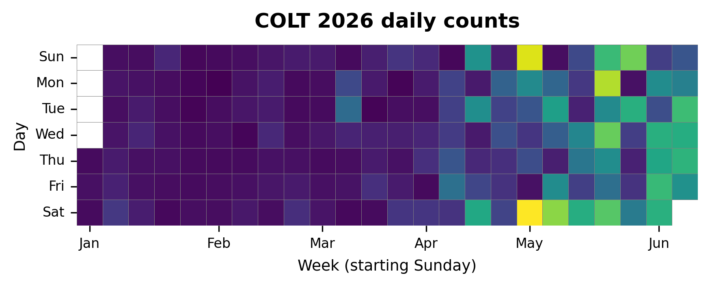

{
  "title": "Chain of Lakes Trail",
  "type": "bikehfxstats-site",
  "as_of": "2026-06-12",
  "counter_id": "colt",
  "short_name": "COLT",
  "active": true,
  "location": "Just south of Ashburn Golf Club driveway",
  "last_seen": "2026-06-13",
  "last_non_zero_seen": "2026-06-12",
  "total_year": 15906,
  "total_all_time": 134956,
  "recent_day": {
    "label": "Jun 12",
    "count": 250
  },
  "recent_seven_days": {
    "label": "Trailing 7 days",
    "count": 1888
  },
  "month_to_date": {
    "label": "Jun to date",
    "count": 3192
  },
  "top_days": [
    {
      "label": "2025-06-15",
      "count": 509
    },
    {
      "label": "2025-09-01",
      "count": 498
    },
    {
      "label": "2026-05-02",
      "count": 492
    },
    {
      "label": "2025-07-01",
      "count": 481
    },
    {
      "label": "2026-04-26",
      "count": 467
    },
    {
      "label": "2023-08-28",
      "count": 455
    },
    {
      "label": "2026-05-18",
      "count": 439
    },
    {
      "label": "2025-09-06",
      "count": 431
    },
    {
      "label": "2023-08-20",
      "count": 425
    },
    {
      "label": "2024-06-09",
      "count": 417
    }
  ],
  "top_weeks": [
    {
      "label": "2025-08-31",
      "count": 2389
    },
    {
      "label": "2026-05-17",
      "count": 2182
    },
    {
      "label": "2025-06-15",
      "count": 2040
    },
    {
      "label": "2025-07-13",
      "count": 1998
    },
    {
      "label": "2024-07-21",
      "count": 1996
    },
    {
      "label": "2024-08-25",
      "count": 1983
    },
    {
      "label": "2025-07-20",
      "count": 1962
    },
    {
      "label": "2025-06-29",
      "count": 1955
    },
    {
      "label": "2024-06-09",
      "count": 1951
    },
    {
      "label": "2024-08-11",
      "count": 1938
    }
  ],
  "top_months": [
    {
      "label": "2025-07",
      "count": 8851
    },
    {
      "label": "2024-07",
      "count": 8027
    },
    {
      "label": "2024-08",
      "count": 7909
    },
    {
      "label": "2025-06",
      "count": 7895
    },
    {
      "label": "2025-09",
      "count": 7693
    },
    {
      "label": "2023-08",
      "count": 7669
    },
    {
      "label": "2024-09",
      "count": 7449
    },
    {
      "label": "2024-06",
      "count": 7033
    },
    {
      "label": "2024-05",
      "count": 6680
    },
    {
      "label": "2026-05",
      "count": 6322
    }
  ],
  "charts": {
    "recent_weekly": "count-by-week-recent-years.png",
    "year_heatmap": "heatmap.png",
    "yearly_totals": "count-by-year.png"
  }
}

Data through 2026-06-12.

## Summary

- Total in 2026: 15906
- Total all-time: 134956
- Active: true
- Last seen: 2026-06-13
- Last non-zero count: 2026-06-12
- Location: Just south of Ashburn Golf Club driveway

## Yearly Totals

## Recent Weekly Trend

## 2026 Daily Heatmap

## Top Days

| Day | Count |
|---|---:|
| 2025-06-15 | 509 |
| 2025-09-01 | 498 |
| 2026-05-02 | 492 |
| 2025-07-01 | 481 |
| 2026-04-26 | 467 |
| 2023-08-28 | 455 |
| 2026-05-18 | 439 |
| 2025-09-06 | 431 |
| 2023-08-20 | 425 |
| 2024-06-09 | 417 |

## Top Weeks

| Week Starting | Count |
|---|---:|
| 2025-08-31 | 2389 |
| 2026-05-17 | 2182 |
| 2025-06-15 | 2040 |
| 2025-07-13 | 1998 |
| 2024-07-21 | 1996 |
| 2024-08-25 | 1983 |
| 2025-07-20 | 1962 |
| 2025-06-29 | 1955 |
| 2024-06-09 | 1951 |
| 2024-08-11 | 1938 |

## Top Months

| Month | Count |
|---|---:|
| 2025-07 | 8851 |
| 2024-07 | 8027 |
| 2024-08 | 7909 |
| 2025-06 | 7895 |
| 2025-09 | 7693 |
| 2023-08 | 7669 |
| 2024-09 | 7449 |
| 2024-06 | 7033 |
| 2024-05 | 6680 |
| 2026-05 | 6322 |
