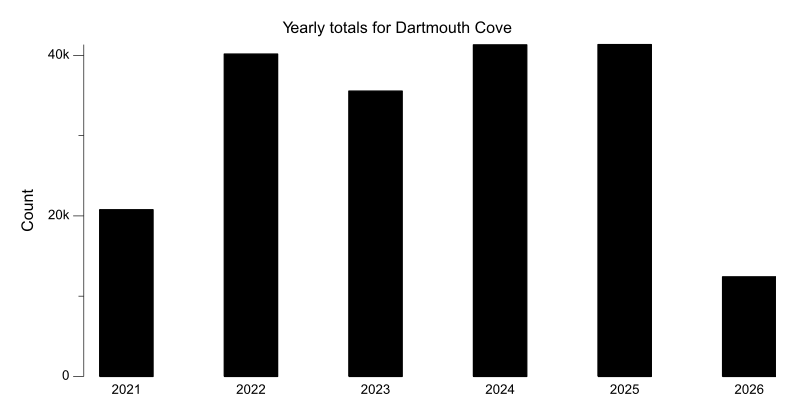
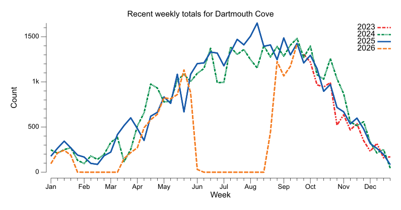
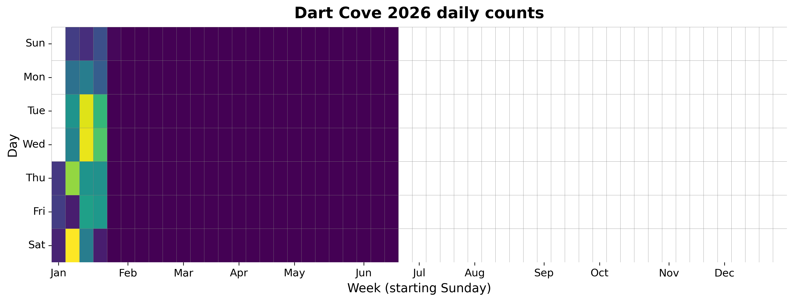
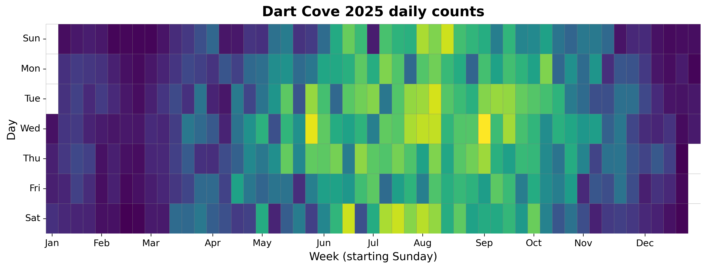
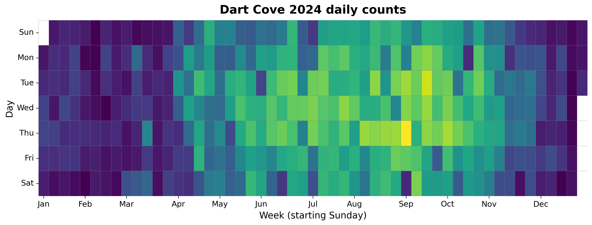
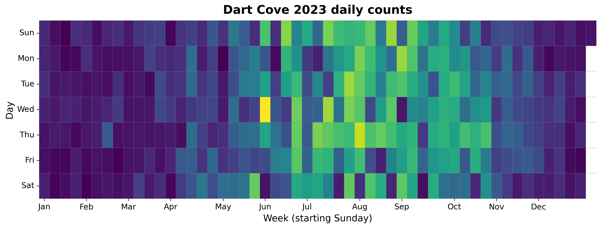
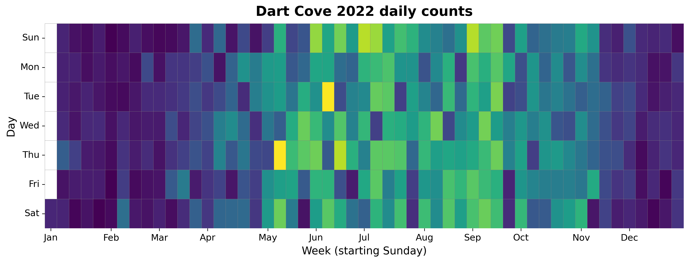
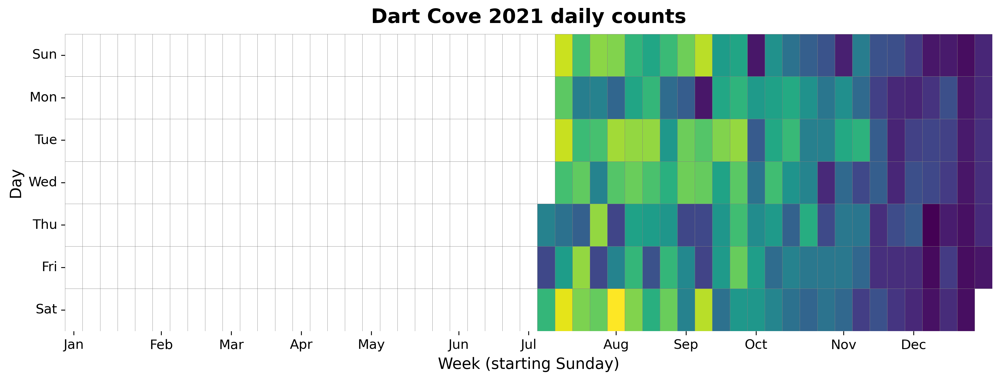

{
  "title": "Dartmouth Cove",
  "type": "bikehfxstats-site",
  "as_of": "2026-06-19",
  "counter_id": "dartmouth-waterfront-c",
  "short_name": "Dart Cove",
  "active": true,
  "location": "Just before the Old Ferry Rd railway crossing when traveling southbound",
  "last_seen": "2026-03-18",
  "last_non_zero_seen": "2026-01-23",
  "total_year": 672,
  "total_all_time": 179812,
  "recent_day": {
    "label": "Jun 19",
    "count": 0
  },
  "recent_seven_days": {
    "label": "Trailing 7 days",
    "count": 0
  },
  "month_to_date": {
    "label": "Jun to date",
    "count": 0
  },
  "top_days": [
    {
      "label": "2022-05-12",
      "count": 322
    },
    {
      "label": "2022-06-07",
      "count": 320
    },
    {
      "label": "2023-05-31",
      "count": 318
    },
    {
      "label": "2023-08-03",
      "count": 290
    },
    {
      "label": "2022-06-16",
      "count": 288
    },
    {
      "label": "2022-06-26",
      "count": 287
    },
    {
      "label": "2025-09-03",
      "count": 286
    },
    {
      "label": "2024-09-05",
      "count": 286
    },
    {
      "label": "2022-08-28",
      "count": 286
    },
    {
      "label": "2025-05-28",
      "count": 276
    }
  ],
  "top_weeks": [
    {
      "label": "2025-08-03",
      "count": 1662
    },
    {
      "label": "2022-09-11",
      "count": 1600
    },
    {
      "label": "2023-07-23",
      "count": 1570
    },
    {
      "label": "2022-09-04",
      "count": 1561
    },
    {
      "label": "2022-08-28",
      "count": 1560
    },
    {
      "label": "2025-07-27",
      "count": 1511
    },
    {
      "label": "2023-07-30",
      "count": 1506
    },
    {
      "label": "2022-07-03",
      "count": 1488
    },
    {
      "label": "2024-09-15",
      "count": 1483
    },
    {
      "label": "2025-08-31",
      "count": 1482
    }
  ],
  "top_months": [
    {
      "label": "2025-07",
      "count": 6292
    },
    {
      "label": "2025-08",
      "count": 6273
    },
    {
      "label": "2024-09",
      "count": 5780
    },
    {
      "label": "2025-09",
      "count": 5755
    },
    {
      "label": "2024-07",
      "count": 5752
    },
    {
      "label": "2024-08",
      "count": 5715
    },
    {
      "label": "2023-07",
      "count": 5654
    },
    {
      "label": "2022-07",
      "count": 5556
    },
    {
      "label": "2023-08",
      "count": 5475
    },
    {
      "label": "2022-08",
      "count": 5401
    }
  ],
  "year_heatmaps": [
    {
      "year": 2026,
      "filename": "heatmap-2026.png"
    },
    {
      "year": 2025,
      "filename": "heatmap-2025.png"
    },
    {
      "year": 2024,
      "filename": "heatmap-2024.png"
    },
    {
      "year": 2023,
      "filename": "heatmap-2023.png"
    },
    {
      "year": 2022,
      "filename": "heatmap-2022.png"
    },
    {
      "year": 2021,
      "filename": "heatmap-2021.png"
    }
  ],
  "charts": {
    "recent_weekly": "count-by-week-recent-years.png",
    "year_heatmap_2021": "heatmap-2021.png",
    "year_heatmap_2022": "heatmap-2022.png",
    "year_heatmap_2023": "heatmap-2023.png",
    "year_heatmap_2024": "heatmap-2024.png",
    "year_heatmap_2025": "heatmap-2025.png",
    "year_heatmap_2026": "heatmap-2026.png",
    "yearly_totals": "count-by-year.png"
  }
}

Data through 2026-06-19.

## Summary

- Total in 2026: 672
- Total all-time: 179812
- Active: true
- Last seen: 2026-03-18
- Last non-zero count: 2026-01-23
- Location: Just before the Old Ferry Rd railway crossing when traveling southbound

## Yearly Totals

## Recent Weekly Trend

## 2026 Daily Heatmap

## 2025 Daily Heatmap

## 2024 Daily Heatmap

## 2023 Daily Heatmap

## 2022 Daily Heatmap

## 2021 Daily Heatmap

## Top Days

| Day | Count |
|---|---:|
| 2022-05-12 | 322 |
| 2022-06-07 | 320 |
| 2023-05-31 | 318 |
| 2023-08-03 | 290 |
| 2022-06-16 | 288 |
| 2022-06-26 | 287 |
| 2025-09-03 | 286 |
| 2024-09-05 | 286 |
| 2022-08-28 | 286 |
| 2025-05-28 | 276 |

## Top Weeks

| Week Starting | Count |
|---|---:|
| 2025-08-03 | 1662 |
| 2022-09-11 | 1600 |
| 2023-07-23 | 1570 |
| 2022-09-04 | 1561 |
| 2022-08-28 | 1560 |
| 2025-07-27 | 1511 |
| 2023-07-30 | 1506 |
| 2022-07-03 | 1488 |
| 2024-09-15 | 1483 |
| 2025-08-31 | 1482 |

## Top Months

| Month | Count |
|---|---:|
| 2025-07 | 6292 |
| 2025-08 | 6273 |
| 2024-09 | 5780 |
| 2025-09 | 5755 |
| 2024-07 | 5752 |
| 2024-08 | 5715 |
| 2023-07 | 5654 |
| 2022-07 | 5556 |
| 2023-08 | 5475 |
| 2022-08 | 5401 |
