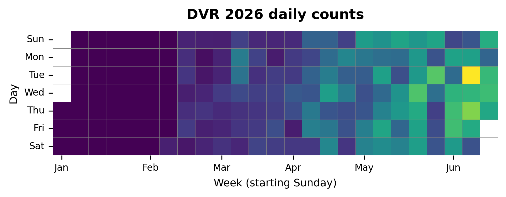

{
  "title": "Dutch Village Road",
  "type": "bikehfxstats-site",
  "as_of": "2026-06-18",
  "counter_id": "dutch-village",
  "short_name": "DVR",
  "active": true,
  "location": "Dutch Village Road at Civic 3400",
  "last_seen": "2026-06-19",
  "last_non_zero_seen": "2026-06-18",
  "total_year": 8619,
  "total_all_time": 8619,
  "recent_day": {
    "label": "Jun 18",
    "count": 126
  },
  "recent_seven_days": {
    "label": "Trailing 7 days",
    "count": 794
  },
  "month_to_date": {
    "label": "Jun to date",
    "count": 2233
  },
  "top_days": [
    {
      "label": "2026-06-09",
      "count": 216
    },
    {
      "label": "2026-06-11",
      "count": 171
    },
    {
      "label": "2026-05-20",
      "count": 153
    },
    {
      "label": "2026-05-26",
      "count": 151
    },
    {
      "label": "2026-06-04",
      "count": 149
    },
    {
      "label": "2026-06-17",
      "count": 148
    },
    {
      "label": "2026-06-05",
      "count": 144
    },
    {
      "label": "2026-06-16",
      "count": 140
    },
    {
      "label": "2026-06-10",
      "count": 140
    },
    {
      "label": "2026-06-03",
      "count": 133
    }
  ],
  "top_weeks": [
    {
      "label": "2026-06-07",
      "count": 884
    },
    {
      "label": "2026-05-17",
      "count": 861
    },
    {
      "label": "2026-05-31",
      "count": 781
    },
    {
      "label": "2026-05-03",
      "count": 694
    },
    {
      "label": "2026-05-10",
      "count": 634
    },
    {
      "label": "2026-06-14",
      "count": 618
    },
    {
      "label": "2026-04-12",
      "count": 579
    },
    {
      "label": "2026-04-26",
      "count": 556
    },
    {
      "label": "2026-05-24",
      "count": 555
    },
    {
      "label": "2026-04-05",
      "count": 445
    }
  ],
  "top_months": [
    {
      "label": "2026-05",
      "count": 2975
    },
    {
      "label": "2026-06",
      "count": 2239
    },
    {
      "label": "2026-04",
      "count": 1979
    },
    {
      "label": "2026-03",
      "count": 1101
    },
    {
      "label": "2026-02",
      "count": 329
    }
  ],
  "charts": {
    "recent_weekly": "count-by-week-recent-years.png",
    "year_heatmap": "heatmap.png",
    "yearly_totals": "count-by-year.png"
  }
}

Data through 2026-06-18.

## Summary

- Total in 2026: 8619
- Total all-time: 8619
- Active: true
- Last seen: 2026-06-19
- Last non-zero count: 2026-06-18
- Location: Dutch Village Road at Civic 3400

## Yearly Totals

## Recent Weekly Trend

## 2026 Daily Heatmap

## Top Days

| Day | Count |
|---|---:|
| 2026-06-09 | 216 |
| 2026-06-11 | 171 |
| 2026-05-20 | 153 |
| 2026-05-26 | 151 |
| 2026-06-04 | 149 |
| 2026-06-17 | 148 |
| 2026-06-05 | 144 |
| 2026-06-16 | 140 |
| 2026-06-10 | 140 |
| 2026-06-03 | 133 |

## Top Weeks

| Week Starting | Count |
|---|---:|
| 2026-06-07 | 884 |
| 2026-05-17 | 861 |
| 2026-05-31 | 781 |
| 2026-05-03 | 694 |
| 2026-05-10 | 634 |
| 2026-06-14 | 618 |
| 2026-04-12 | 579 |
| 2026-04-26 | 556 |
| 2026-05-24 | 555 |
| 2026-04-05 | 445 |

## Top Months

| Month | Count |
|---|---:|
| 2026-05 | 2975 |
| 2026-06 | 2239 |
| 2026-04 | 1979 |
| 2026-03 | 1101 |
| 2026-02 | 329 |
