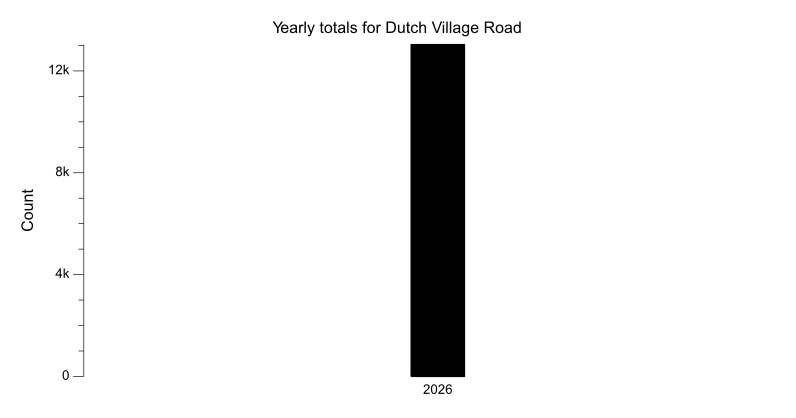
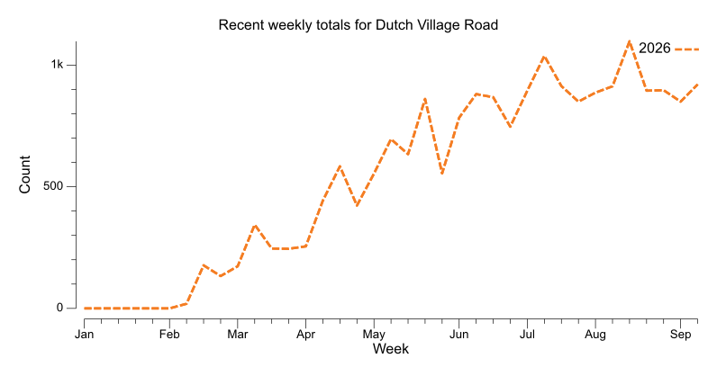
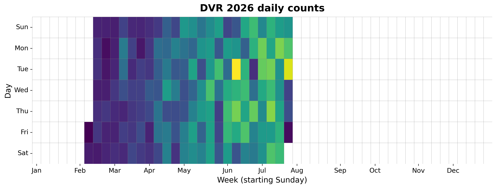

{
  "title": "Dutch Village Road",
  "type": "bikehfxstats-site",
  "as_of": "2026-07-23",
  "counter_id": "dutch-village",
  "short_name": "DVR",
  "active": true,
  "location": "Dutch Village Road at Civic 3400",
  "last_seen": "2026-07-24",
  "last_non_zero_seen": "2026-07-23",
  "total_year": 13033,
  "total_all_time": 13033,
  "recent_day": {
    "label": "Jul 23",
    "count": 50
  },
  "recent_seven_days": {
    "label": "Trailing 7 days",
    "count": 849
  },
  "month_to_date": {
    "label": "Jul to date",
    "count": 2981
  },
  "top_days": [
    {
      "label": "2026-06-09",
      "count": 216
    },
    {
      "label": "2026-07-21",
      "count": 204
    },
    {
      "label": "2026-07-09",
      "count": 177
    },
    {
      "label": "2026-07-13",
      "count": 173
    },
    {
      "label": "2026-06-11",
      "count": 171
    },
    {
      "label": "2026-07-07",
      "count": 170
    },
    {
      "label": "2026-06-29",
      "count": 168
    },
    {
      "label": "2026-06-30",
      "count": 165
    },
    {
      "label": "2026-06-25",
      "count": 165
    },
    {
      "label": "2026-07-20",
      "count": 156
    }
  ],
  "top_weeks": [
    {
      "label": "2026-07-05",
      "count": 1035
    },
    {
      "label": "2026-07-12",
      "count": 924
    },
    {
      "label": "2026-06-28",
      "count": 893
    },
    {
      "label": "2026-06-07",
      "count": 884
    },
    {
      "label": "2026-06-14",
      "count": 861
    },
    {
      "label": "2026-05-17",
      "count": 861
    },
    {
      "label": "2026-05-31",
      "count": 781
    },
    {
      "label": "2026-06-21",
      "count": 743
    },
    {
      "label": "2026-05-03",
      "count": 694
    },
    {
      "label": "2026-05-10",
      "count": 634
    }
  ],
  "top_months": [
    {
      "label": "2026-06",
      "count": 3659
    },
    {
      "label": "2026-07",
      "count": 2991
    },
    {
      "label": "2026-05",
      "count": 2975
    },
    {
      "label": "2026-04",
      "count": 1979
    },
    {
      "label": "2026-03",
      "count": 1101
    },
    {
      "label": "2026-02",
      "count": 329
    }
  ],
  "year_heatmaps": [
    {
      "year": 2026,
      "filename": "heatmap-2026.png"
    }
  ],
  "charts": {
    "recent_weekly": "count-by-week-recent-years.png",
    "year_heatmap_2026": "heatmap-2026.png",
    "yearly_totals": "count-by-year.png"
  }
}

Data through 2026-07-23.

## Summary

- Total in 2026: 13033
- Total all-time: 13033
- Active: true
- Last seen: 2026-07-24
- Last non-zero count: 2026-07-23
- Location: Dutch Village Road at Civic 3400

## Yearly Totals

## Recent Weekly Trend

## 2026 Daily Heatmap

## Top Days

| Day | Count |
|---|---:|
| 2026-06-09 | 216 |
| 2026-07-21 | 204 |
| 2026-07-09 | 177 |
| 2026-07-13 | 173 |
| 2026-06-11 | 171 |
| 2026-07-07 | 170 |
| 2026-06-29 | 168 |
| 2026-06-30 | 165 |
| 2026-06-25 | 165 |
| 2026-07-20 | 156 |

## Top Weeks

| Week Starting | Count |
|---|---:|
| 2026-07-05 | 1035 |
| 2026-07-12 | 924 |
| 2026-06-28 | 893 |
| 2026-06-07 | 884 |
| 2026-06-14 | 861 |
| 2026-05-17 | 861 |
| 2026-05-31 | 781 |
| 2026-06-21 | 743 |
| 2026-05-03 | 694 |
| 2026-05-10 | 634 |

## Top Months

| Month | Count |
|---|---:|
| 2026-06 | 3659 |
| 2026-07 | 2991 |
| 2026-05 | 2975 |
| 2026-04 | 1979 |
| 2026-03 | 1101 |
| 2026-02 | 329 |
