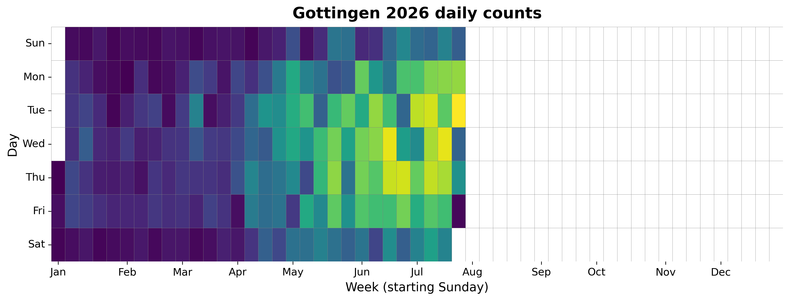
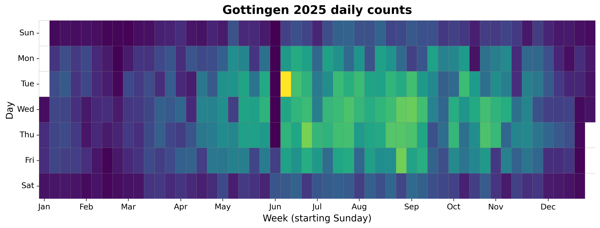
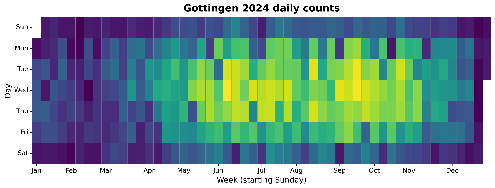
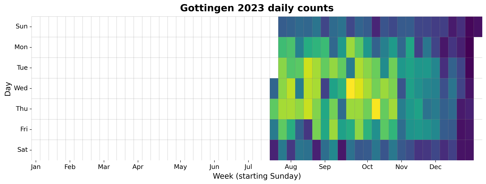

{
  "title": "Gottingen",
  "type": "bikehfxstats-site",
  "as_of": "2026-07-23",
  "counter_id": "gottingen",
  "active": true,
  "location": "Near south end of Gottingen",
  "last_seen": "2026-07-24",
  "last_non_zero_seen": "2026-07-23",
  "total_year": 25003,
  "total_all_time": 131630,
  "recent_day": {
    "label": "Jul 23",
    "count": 187
  },
  "recent_seven_days": {
    "label": "Trailing 7 days",
    "count": 1514
  },
  "month_to_date": {
    "label": "Jul to date",
    "count": 5670
  },
  "top_days": [
    {
      "label": "2025-06-10",
      "count": 379
    },
    {
      "label": "2026-07-21",
      "count": 368
    },
    {
      "label": "2026-07-15",
      "count": 355
    },
    {
      "label": "2026-06-17",
      "count": 355
    },
    {
      "label": "2026-07-07",
      "count": 343
    },
    {
      "label": "2026-06-25",
      "count": 343
    },
    {
      "label": "2026-06-18",
      "count": 338
    },
    {
      "label": "2026-07-09",
      "count": 334
    },
    {
      "label": "2026-06-30",
      "count": 332
    },
    {
      "label": "2026-07-16",
      "count": 321
    }
  ],
  "top_weeks": [
    {
      "label": "2026-07-05",
      "count": 1894
    },
    {
      "label": "2026-07-12",
      "count": 1842
    },
    {
      "label": "2026-06-14",
      "count": 1658
    },
    {
      "label": "2026-06-28",
      "count": 1576
    },
    {
      "label": "2026-05-31",
      "count": 1546
    },
    {
      "label": "2026-06-21",
      "count": 1511
    },
    {
      "label": "2026-05-17",
      "count": 1501
    },
    {
      "label": "2026-06-07",
      "count": 1469
    },
    {
      "label": "2025-06-08",
      "count": 1449
    },
    {
      "label": "2025-07-13",
      "count": 1427
    }
  ],
  "top_months": [
    {
      "label": "2026-06",
      "count": 6863
    },
    {
      "label": "2025-07",
      "count": 5904
    },
    {
      "label": "2026-07",
      "count": 5692
    },
    {
      "label": "2024-07",
      "count": 5650
    },
    {
      "label": "2025-08",
      "count": 5556
    },
    {
      "label": "2024-10",
      "count": 5305
    },
    {
      "label": "2024-09",
      "count": 5294
    },
    {
      "label": "2026-05",
      "count": 5154
    },
    {
      "label": "2024-08",
      "count": 5098
    },
    {
      "label": "2024-06",
      "count": 5069
    }
  ],
  "year_heatmaps": [
    {
      "year": 2026,
      "filename": "heatmap-2026.png"
    },
    {
      "year": 2025,
      "filename": "heatmap-2025.png"
    },
    {
      "year": 2024,
      "filename": "heatmap-2024.png"
    },
    {
      "year": 2023,
      "filename": "heatmap-2023.png"
    }
  ],
  "charts": {
    "recent_weekly": "count-by-week-recent-years.png",
    "year_heatmap_2023": "heatmap-2023.png",
    "year_heatmap_2024": "heatmap-2024.png",
    "year_heatmap_2025": "heatmap-2025.png",
    "year_heatmap_2026": "heatmap-2026.png",
    "yearly_totals": "count-by-year.png"
  }
}

Data through 2026-07-23.

## Summary

- Total in 2026: 25003
- Total all-time: 131630
- Active: true
- Last seen: 2026-07-24
- Last non-zero count: 2026-07-23
- Location: Near south end of Gottingen

## Yearly Totals

## Recent Weekly Trend

## 2026 Daily Heatmap

## 2025 Daily Heatmap

## 2024 Daily Heatmap

## 2023 Daily Heatmap

## Top Days

| Day | Count |
|---|---:|
| 2025-06-10 | 379 |
| 2026-07-21 | 368 |
| 2026-07-15 | 355 |
| 2026-06-17 | 355 |
| 2026-07-07 | 343 |
| 2026-06-25 | 343 |
| 2026-06-18 | 338 |
| 2026-07-09 | 334 |
| 2026-06-30 | 332 |
| 2026-07-16 | 321 |

## Top Weeks

| Week Starting | Count |
|---|---:|
| 2026-07-05 | 1894 |
| 2026-07-12 | 1842 |
| 2026-06-14 | 1658 |
| 2026-06-28 | 1576 |
| 2026-05-31 | 1546 |
| 2026-06-21 | 1511 |
| 2026-05-17 | 1501 |
| 2026-06-07 | 1469 |
| 2025-06-08 | 1449 |
| 2025-07-13 | 1427 |

## Top Months

| Month | Count |
|---|---:|
| 2026-06 | 6863 |
| 2025-07 | 5904 |
| 2026-07 | 5692 |
| 2024-07 | 5650 |
| 2025-08 | 5556 |
| 2024-10 | 5305 |
| 2024-09 | 5294 |
| 2026-05 | 5154 |
| 2024-08 | 5098 |
| 2024-06 | 5069 |
