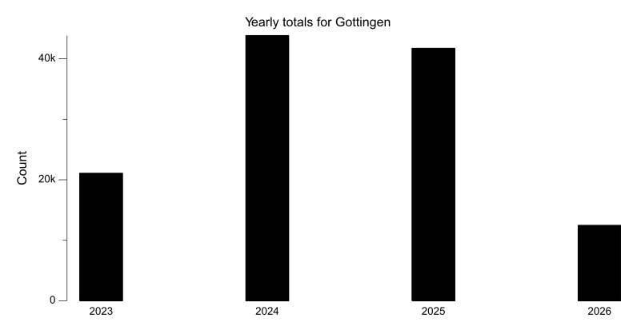
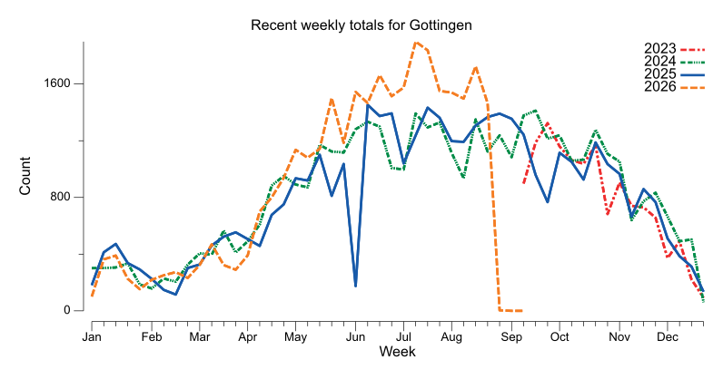
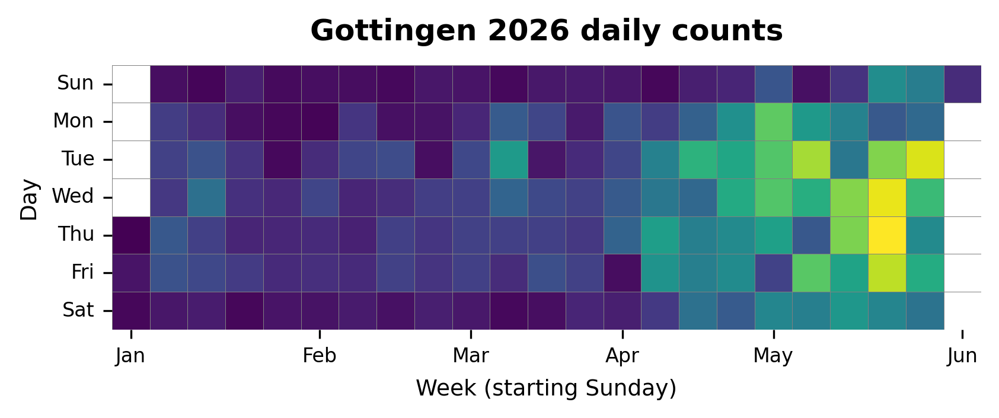

{
  "title": "Gottingen",
  "type": "bikehfxstats-site",
  "as_of": "2026-05-31",
  "counter_id": "gottingen",
  "active": true,
  "location": "Near south end of Gottingen",
  "last_seen": "2026-06-01",
  "last_non_zero_seen": "2026-06-01",
  "total_year": 12455,
  "total_all_time": 119082,
  "recent_day": {
    "label": "May 31",
    "count": 39
  },
  "recent_seven_days": {
    "label": "Trailing 7 days",
    "count": 1094
  },
  "month_to_date": {
    "label": "May to date",
    "count": 5152
  },
  "top_days": [
    {
      "label": "2025-06-10",
      "count": 379
    },
    {
      "label": "2026-05-21",
      "count": 306
    },
    {
      "label": "2025-06-26",
      "count": 301
    },
    {
      "label": "2025-08-29",
      "count": 297
    },
    {
      "label": "2025-09-03",
      "count": 293
    },
    {
      "label": "2026-05-20",
      "count": 290
    },
    {
      "label": "2025-08-27",
      "count": 288
    },
    {
      "label": "2024-06-05",
      "count": 283
    },
    {
      "label": "2026-05-26",
      "count": 280
    },
    {
      "label": "2024-09-18",
      "count": 279
    }
  ],
  "top_weeks": [
    {
      "label": "2026-05-17",
      "count": 1501
    },
    {
      "label": "2025-06-08",
      "count": 1449
    },
    {
      "label": "2025-07-13",
      "count": 1427
    },
    {
      "label": "2024-09-15",
      "count": 1407
    },
    {
      "label": "2025-06-22",
      "count": 1395
    },
    {
      "label": "2025-08-24",
      "count": 1387
    },
    {
      "label": "2024-07-07",
      "count": 1380
    },
    {
      "label": "2024-09-08",
      "count": 1379
    },
    {
      "label": "2025-06-15",
      "count": 1373
    },
    {
      "label": "2025-08-17",
      "count": 1367
    }
  ],
  "top_months": [
    {
      "label": "2025-07",
      "count": 5904
    },
    {
      "label": "2024-07",
      "count": 5650
    },
    {
      "label": "2025-08",
      "count": 5556
    },
    {
      "label": "2024-10",
      "count": 5305
    },
    {
      "label": "2024-09",
      "count": 5294
    },
    {
      "label": "2026-05",
      "count": 5154
    },
    {
      "label": "2024-08",
      "count": 5098
    },
    {
      "label": "2024-06",
      "count": 5069
    },
    {
      "label": "2023-08",
      "count": 4912
    },
    {
      "label": "2025-10",
      "count": 4883
    }
  ],
  "charts": {
    "recent_weekly": "count-by-week-recent-years.png",
    "year_heatmap": "heatmap.png",
    "yearly_totals": "count-by-year.png"
  }
}

Data through 2026-05-31.

## Summary

- Total in 2026: 12455
- Total all-time: 119082
- Active: true
- Last seen: 2026-06-01
- Last non-zero count: 2026-06-01
- Location: Near south end of Gottingen

## Yearly Totals

## Recent Weekly Trend

## 2026 Daily Heatmap

## Top Days

| Day | Count |
|---|---:|
| 2025-06-10 | 379 |
| 2026-05-21 | 306 |
| 2025-06-26 | 301 |
| 2025-08-29 | 297 |
| 2025-09-03 | 293 |
| 2026-05-20 | 290 |
| 2025-08-27 | 288 |
| 2024-06-05 | 283 |
| 2026-05-26 | 280 |
| 2024-09-18 | 279 |

## Top Weeks

| Week Starting | Count |
|---|---:|
| 2026-05-17 | 1501 |
| 2025-06-08 | 1449 |
| 2025-07-13 | 1427 |
| 2024-09-15 | 1407 |
| 2025-06-22 | 1395 |
| 2025-08-24 | 1387 |
| 2024-07-07 | 1380 |
| 2024-09-08 | 1379 |
| 2025-06-15 | 1373 |
| 2025-08-17 | 1367 |

## Top Months

| Month | Count |
|---|---:|
| 2025-07 | 5904 |
| 2024-07 | 5650 |
| 2025-08 | 5556 |
| 2024-10 | 5305 |
| 2024-09 | 5294 |
| 2026-05 | 5154 |
| 2024-08 | 5098 |
| 2024-06 | 5069 |
| 2023-08 | 4912 |
| 2025-10 | 4883 |
