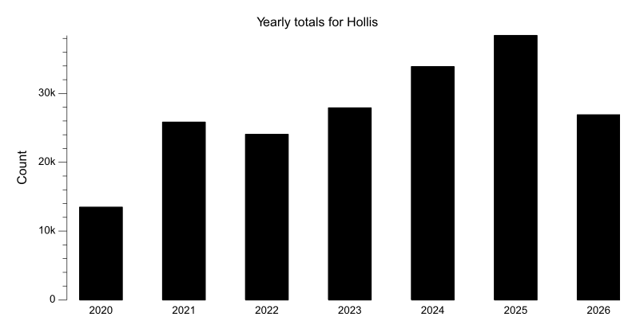
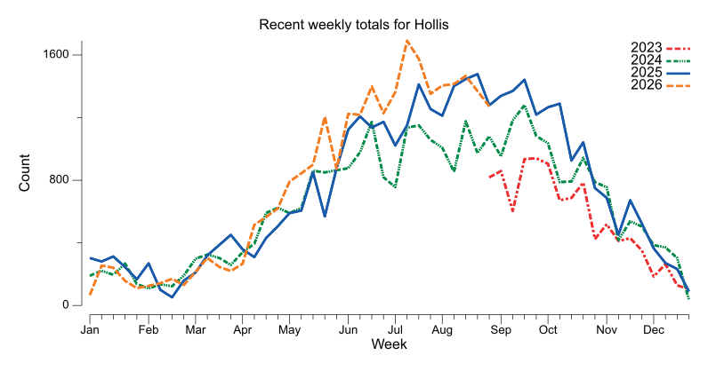
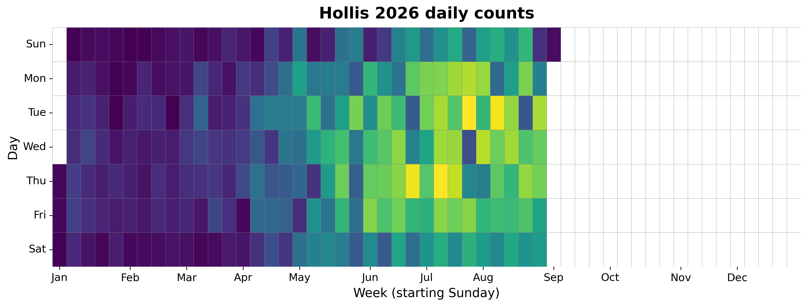
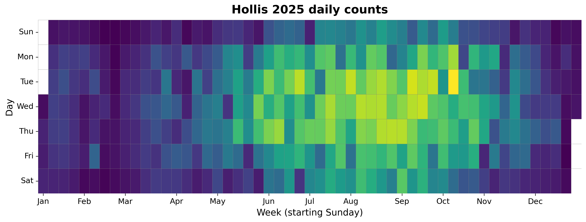
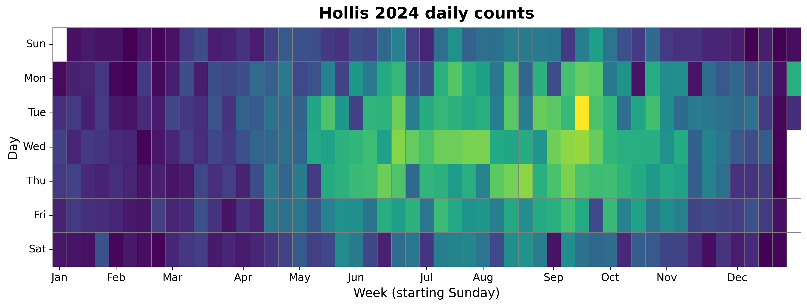
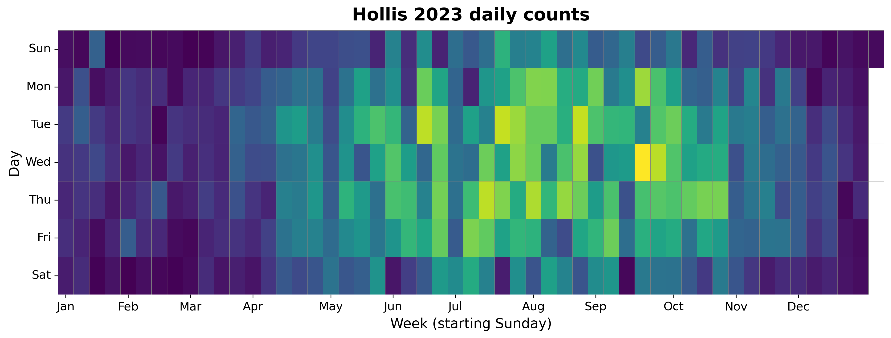
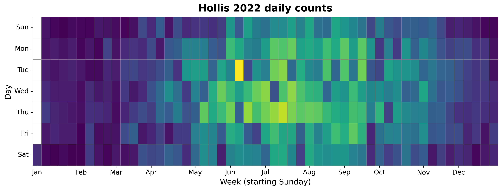
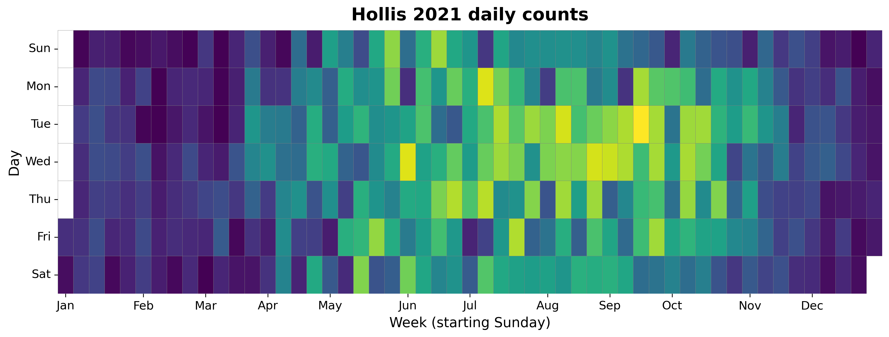
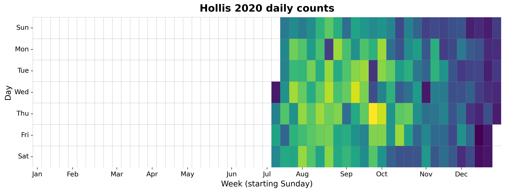

{
  "title": "Hollis",
  "type": "bikehfxstats-site",
  "as_of": "2026-08-29",
  "counter_id": "hollis",
  "active": true,
  "location": "Hollis St just south of George St",
  "last_seen": "2026-08-30",
  "last_non_zero_seen": "2026-08-29",
  "total_year": 26890,
  "total_all_time": 190460,
  "recent_day": {
    "label": "Aug 29",
    "count": 165
  },
  "recent_seven_days": {
    "label": "Trailing 7 days",
    "count": 1272
  },
  "month_to_date": {
    "label": "Aug to date",
    "count": 5690
  },
  "top_days": [
    {
      "label": "2026-07-21",
      "count": 307
    },
    {
      "label": "2026-07-09",
      "count": 306
    },
    {
      "label": "2026-08-04",
      "count": 301
    },
    {
      "label": "2026-06-25",
      "count": 299
    },
    {
      "label": "2025-10-07",
      "count": 288
    },
    {
      "label": "2026-07-16",
      "count": 279
    },
    {
      "label": "2026-07-29",
      "count": 274
    },
    {
      "label": "2026-07-20",
      "count": 271
    },
    {
      "label": "2024-09-17",
      "count": 270
    },
    {
      "label": "2025-09-09",
      "count": 269
    }
  ],
  "top_weeks": [
    {
      "label": "2026-07-05",
      "count": 1680
    },
    {
      "label": "2026-07-12",
      "count": 1597
    },
    {
      "label": "2025-08-17",
      "count": 1477
    },
    {
      "label": "2025-08-10",
      "count": 1448
    },
    {
      "label": "2025-09-14",
      "count": 1445
    },
    {
      "label": "2026-08-09",
      "count": 1441
    },
    {
      "label": "2026-08-02",
      "count": 1421
    },
    {
      "label": "2025-07-13",
      "count": 1415
    },
    {
      "label": "2026-07-26",
      "count": 1410
    },
    {
      "label": "2025-08-03",
      "count": 1404
    }
  ],
  "top_months": [
    {
      "label": "2026-07",
      "count": 6621
    },
    {
      "label": "2025-08",
      "count": 5982
    },
    {
      "label": "2025-09",
      "count": 5755
    },
    {
      "label": "2026-08",
      "count": 5700
    },
    {
      "label": "2026-06",
      "count": 5635
    },
    {
      "label": "2025-07",
      "count": 5625
    },
    {
      "label": "2025-06",
      "count": 4812
    },
    {
      "label": "2024-07",
      "count": 4721
    },
    {
      "label": "2025-10",
      "count": 4716
    },
    {
      "label": "2024-09",
      "count": 4711
    }
  ],
  "year_heatmaps": [
    {
      "year": 2026,
      "filename": "heatmap-2026.png"
    },
    {
      "year": 2025,
      "filename": "heatmap-2025.png"
    },
    {
      "year": 2024,
      "filename": "heatmap-2024.png"
    },
    {
      "year": 2023,
      "filename": "heatmap-2023.png"
    },
    {
      "year": 2022,
      "filename": "heatmap-2022.png"
    },
    {
      "year": 2021,
      "filename": "heatmap-2021.png"
    },
    {
      "year": 2020,
      "filename": "heatmap-2020.png"
    }
  ],
  "charts": {
    "recent_weekly": "count-by-week-recent-years.png",
    "year_heatmap_2020": "heatmap-2020.png",
    "year_heatmap_2021": "heatmap-2021.png",
    "year_heatmap_2022": "heatmap-2022.png",
    "year_heatmap_2023": "heatmap-2023.png",
    "year_heatmap_2024": "heatmap-2024.png",
    "year_heatmap_2025": "heatmap-2025.png",
    "year_heatmap_2026": "heatmap-2026.png",
    "yearly_totals": "count-by-year.png"
  }
}

Data through 2026-08-29.

## Summary

- Total in 2026: 26890
- Total all-time: 190460
- Active: true
- Last seen: 2026-08-30
- Last non-zero count: 2026-08-29
- Location: Hollis St just south of George St

## Yearly Totals

## Recent Weekly Trend

## 2026 Daily Heatmap

## 2025 Daily Heatmap

## 2024 Daily Heatmap

## 2023 Daily Heatmap

## 2022 Daily Heatmap

## 2021 Daily Heatmap

## 2020 Daily Heatmap

## Top Days

| Day | Count |
|---|---:|
| 2026-07-21 | 307 |
| 2026-07-09 | 306 |
| 2026-08-04 | 301 |
| 2026-06-25 | 299 |
| 2025-10-07 | 288 |
| 2026-07-16 | 279 |
| 2026-07-29 | 274 |
| 2026-07-20 | 271 |
| 2024-09-17 | 270 |
| 2025-09-09 | 269 |

## Top Weeks

| Week Starting | Count |
|---|---:|
| 2026-07-05 | 1680 |
| 2026-07-12 | 1597 |
| 2025-08-17 | 1477 |
| 2025-08-10 | 1448 |
| 2025-09-14 | 1445 |
| 2026-08-09 | 1441 |
| 2026-08-02 | 1421 |
| 2025-07-13 | 1415 |
| 2026-07-26 | 1410 |
| 2025-08-03 | 1404 |

## Top Months

| Month | Count |
|---|---:|
| 2026-07 | 6621 |
| 2025-08 | 5982 |
| 2025-09 | 5755 |
| 2026-08 | 5700 |
| 2026-06 | 5635 |
| 2025-07 | 5625 |
| 2025-06 | 4812 |
| 2024-07 | 4721 |
| 2025-10 | 4716 |
| 2024-09 | 4711 |
