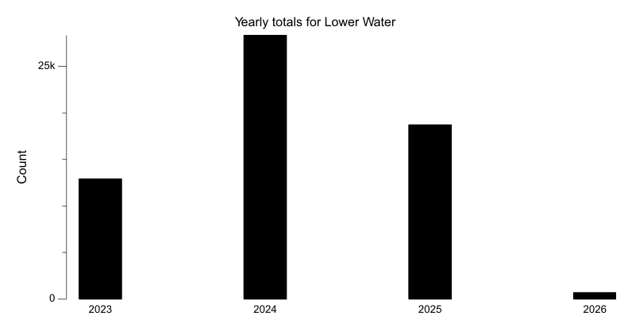
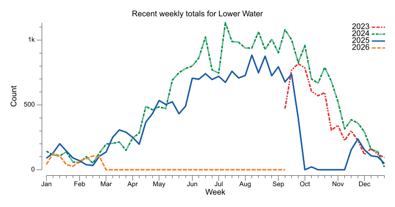
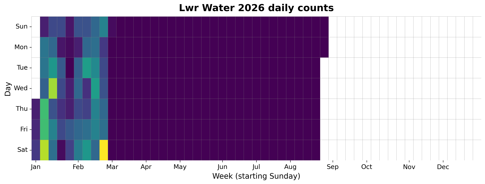
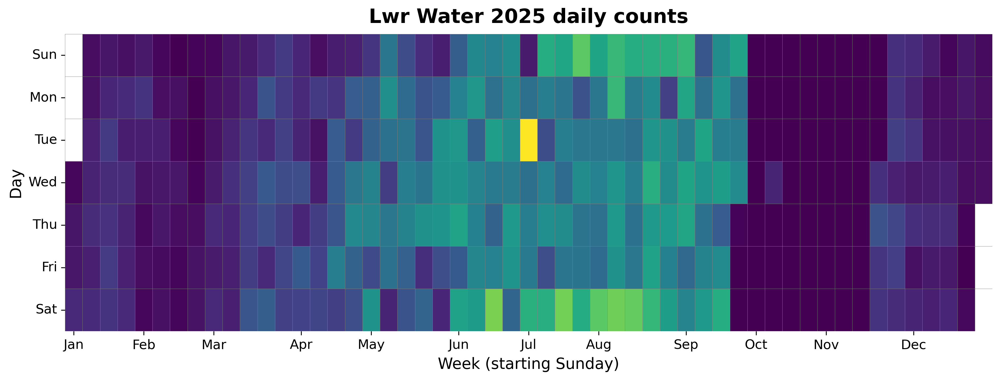
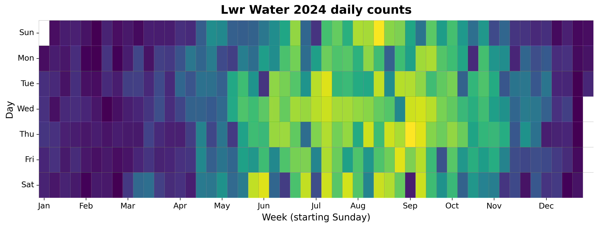
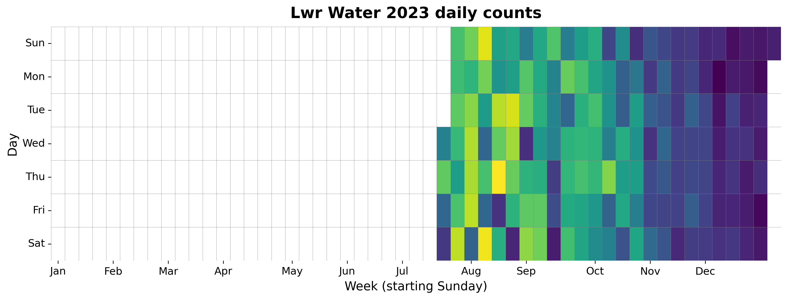

{
  "title": "Lower Water",
  "type": "bikehfxstats-site",
  "as_of": "2026-08-23",
  "counter_id": "lower-water",
  "short_name": "Lwr Water",
  "active": true,
  "location": "Across from Alexander Keith's Brewery",
  "last_seen": "2026-02-28",
  "last_non_zero_seen": "2026-02-28",
  "total_year": 673,
  "total_all_time": 60618,
  "recent_day": {
    "label": "Aug 23",
    "count": 0
  },
  "recent_seven_days": {
    "label": "Trailing 7 days",
    "count": 0
  },
  "month_to_date": {
    "label": "Aug to date",
    "count": 0
  },
  "top_days": [
    {
      "label": "2025-07-01",
      "count": 219
    },
    {
      "label": "2024-09-05",
      "count": 187
    },
    {
      "label": "2024-08-11",
      "count": 185
    },
    {
      "label": "2023-08-17",
      "count": 185
    },
    {
      "label": "2023-08-12",
      "count": 181
    },
    {
      "label": "2024-09-12",
      "count": 178
    },
    {
      "label": "2024-08-30",
      "count": 178
    },
    {
      "label": "2024-07-09",
      "count": 177
    },
    {
      "label": "2024-06-01",
      "count": 177
    },
    {
      "label": "2023-08-06",
      "count": 177
    }
  ],
  "top_weeks": [
    {
      "label": "2024-07-07",
      "count": 1127
    },
    {
      "label": "2024-09-08",
      "count": 1077
    },
    {
      "label": "2024-08-11",
      "count": 1060
    },
    {
      "label": "2024-06-16",
      "count": 1023
    },
    {
      "label": "2024-08-25",
      "count": 1015
    },
    {
      "label": "2024-09-15",
      "count": 1007
    },
    {
      "label": "2024-07-14",
      "count": 992
    },
    {
      "label": "2024-07-21",
      "count": 984
    },
    {
      "label": "2024-09-29",
      "count": 968
    },
    {
      "label": "2023-07-30",
      "count": 967
    }
  ],
  "top_months": [
    {
      "label": "2024-07",
      "count": 4377
    },
    {
      "label": "2024-08",
      "count": 4325
    },
    {
      "label": "2024-09",
      "count": 4066
    },
    {
      "label": "2023-08",
      "count": 3726
    },
    {
      "label": "2024-06",
      "count": 3660
    },
    {
      "label": "2025-08",
      "count": 3632
    },
    {
      "label": "2024-10",
      "count": 3352
    },
    {
      "label": "2025-07",
      "count": 3235
    },
    {
      "label": "2023-09",
      "count": 3199
    },
    {
      "label": "2025-06",
      "count": 2937
    }
  ],
  "year_heatmaps": [
    {
      "year": 2026,
      "filename": "heatmap-2026.png"
    },
    {
      "year": 2025,
      "filename": "heatmap-2025.png"
    },
    {
      "year": 2024,
      "filename": "heatmap-2024.png"
    },
    {
      "year": 2023,
      "filename": "heatmap-2023.png"
    }
  ],
  "charts": {
    "recent_weekly": "count-by-week-recent-years.png",
    "year_heatmap_2023": "heatmap-2023.png",
    "year_heatmap_2024": "heatmap-2024.png",
    "year_heatmap_2025": "heatmap-2025.png",
    "year_heatmap_2026": "heatmap-2026.png",
    "yearly_totals": "count-by-year.png"
  }
}

Data through 2026-08-23.

## Summary

- Total in 2026: 673
- Total all-time: 60618
- Active: true
- Last seen: 2026-02-28
- Last non-zero count: 2026-02-28
- Location: Across from Alexander Keith's Brewery

## Yearly Totals

## Recent Weekly Trend

## 2026 Daily Heatmap

## 2025 Daily Heatmap

## 2024 Daily Heatmap

## 2023 Daily Heatmap

## Top Days

| Day | Count |
|---|---:|
| 2025-07-01 | 219 |
| 2024-09-05 | 187 |
| 2024-08-11 | 185 |
| 2023-08-17 | 185 |
| 2023-08-12 | 181 |
| 2024-09-12 | 178 |
| 2024-08-30 | 178 |
| 2024-07-09 | 177 |
| 2024-06-01 | 177 |
| 2023-08-06 | 177 |

## Top Weeks

| Week Starting | Count |
|---|---:|
| 2024-07-07 | 1127 |
| 2024-09-08 | 1077 |
| 2024-08-11 | 1060 |
| 2024-06-16 | 1023 |
| 2024-08-25 | 1015 |
| 2024-09-15 | 1007 |
| 2024-07-14 | 992 |
| 2024-07-21 | 984 |
| 2024-09-29 | 968 |
| 2023-07-30 | 967 |

## Top Months

| Month | Count |
|---|---:|
| 2024-07 | 4377 |
| 2024-08 | 4325 |
| 2024-09 | 4066 |
| 2023-08 | 3726 |
| 2024-06 | 3660 |
| 2025-08 | 3632 |
| 2024-10 | 3352 |
| 2025-07 | 3235 |
| 2023-09 | 3199 |
| 2025-06 | 2937 |
