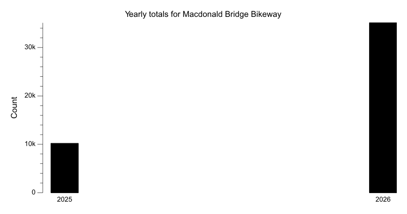
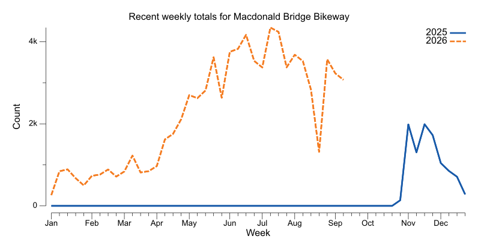
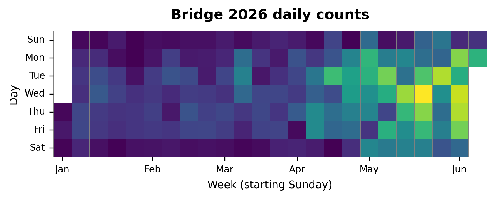

{
  "title": "Macdonald Bridge Bikeway",
  "type": "bikehfxstats-site",
  "as_of": "2026-06-08",
  "counter_id": "macdonald-bridge2",
  "short_name": "Bridge",
  "active": true,
  "location": "On the Dartmouth side of the bridge bikeway",
  "last_seen": "2026-06-09",
  "last_non_zero_seen": "2026-06-08",
  "total_year": 35100,
  "total_all_time": 45291,
  "recent_day": {
    "label": "Jun 8",
    "count": 540
  },
  "recent_seven_days": {
    "label": "Trailing 7 days",
    "count": 3636
  },
  "month_to_date": {
    "label": "Jun to date",
    "count": 4318
  },
  "top_days": [
    {
      "label": "2026-05-20",
      "count": 818
    },
    {
      "label": "2026-06-03",
      "count": 751
    },
    {
      "label": "2026-06-04",
      "count": 732
    },
    {
      "label": "2026-05-26",
      "count": 729
    },
    {
      "label": "2026-05-13",
      "count": 711
    },
    {
      "label": "2026-05-21",
      "count": 706
    },
    {
      "label": "2026-06-05",
      "count": 669
    },
    {
      "label": "2026-06-01",
      "count": 668
    },
    {
      "label": "2026-05-05",
      "count": 650
    },
    {
      "label": "2026-05-19",
      "count": 609
    }
  ],
  "top_weeks": [
    {
      "label": "2026-05-31",
      "count": 3747
    },
    {
      "label": "2026-05-17",
      "count": 3627
    },
    {
      "label": "2026-05-10",
      "count": 2807
    },
    {
      "label": "2026-04-26",
      "count": 2693
    },
    {
      "label": "2026-05-24",
      "count": 2642
    },
    {
      "label": "2026-05-03",
      "count": 2628
    },
    {
      "label": "2026-04-19",
      "count": 2107
    },
    {
      "label": "2025-11-16",
      "count": 2003
    },
    {
      "label": "2025-11-02",
      "count": 1974
    },
    {
      "label": "2026-04-12",
      "count": 1759
    }
  ],
  "top_months": [
    {
      "label": "2026-05",
      "count": 12319
    },
    {
      "label": "2026-04",
      "count": 8170
    },
    {
      "label": "2025-11",
      "count": 7231
    },
    {
      "label": "2026-06",
      "count": 4330
    },
    {
      "label": "2026-03",
      "count": 4186
    },
    {
      "label": "2026-02",
      "count": 3101
    },
    {
      "label": "2026-01",
      "count": 2998
    },
    {
      "label": "2025-12",
      "count": 2959
    }
  ],
  "charts": {
    "recent_weekly": "count-by-week-recent-years.png",
    "year_heatmap": "heatmap.png",
    "yearly_totals": "count-by-year.png"
  }
}

Data through 2026-06-08.

## Summary

- Total in 2026: 35100
- Total all-time: 45291
- Active: true
- Last seen: 2026-06-09
- Last non-zero count: 2026-06-08
- Location: On the Dartmouth side of the bridge bikeway

## Yearly Totals

## Recent Weekly Trend

## 2026 Daily Heatmap

## Top Days

| Day | Count |
|---|---:|
| 2026-05-20 | 818 |
| 2026-06-03 | 751 |
| 2026-06-04 | 732 |
| 2026-05-26 | 729 |
| 2026-05-13 | 711 |
| 2026-05-21 | 706 |
| 2026-06-05 | 669 |
| 2026-06-01 | 668 |
| 2026-05-05 | 650 |
| 2026-05-19 | 609 |

## Top Weeks

| Week Starting | Count |
|---|---:|
| 2026-05-31 | 3747 |
| 2026-05-17 | 3627 |
| 2026-05-10 | 2807 |
| 2026-04-26 | 2693 |
| 2026-05-24 | 2642 |
| 2026-05-03 | 2628 |
| 2026-04-19 | 2107 |
| 2025-11-16 | 2003 |
| 2025-11-02 | 1974 |
| 2026-04-12 | 1759 |

## Top Months

| Month | Count |
|---|---:|
| 2026-05 | 12319 |
| 2026-04 | 8170 |
| 2025-11 | 7231 |
| 2026-06 | 4330 |
| 2026-03 | 4186 |
| 2026-02 | 3101 |
| 2026-01 | 2998 |
| 2025-12 | 2959 |
