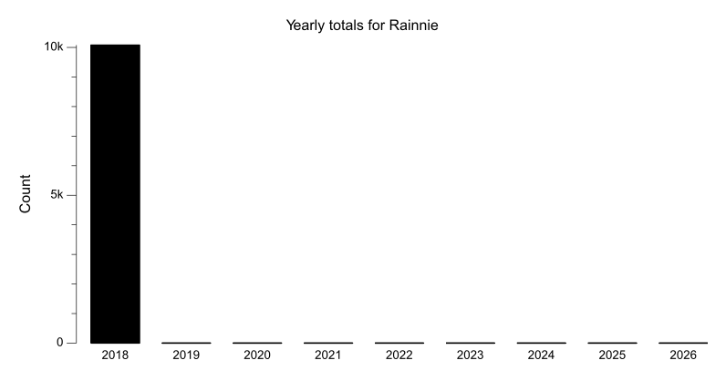
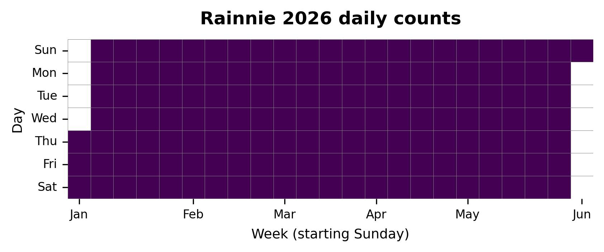

{
  "title": "Rainnie",
  "type": "bikehfxstats-site",
  "as_of": "2026-05-31",
  "counter_id": "rainnie",
  "location": "Rainnie Dr midway",
  "last_seen": "2018-11-15",
  "last_non_zero_seen": "2018-11-15",
  "total_all_time": 10079,
  "recent_day": {
    "label": "May 31",
    "count": 0
  },
  "recent_seven_days": {
    "label": "Trailing 7 days",
    "count": 0
  },
  "month_to_date": {
    "label": "May to date",
    "count": 0
  },
  "top_days": [
    {
      "label": "2018-09-18",
      "count": 283
    },
    {
      "label": "2018-09-25",
      "count": 241
    },
    {
      "label": "2018-09-13",
      "count": 241
    },
    {
      "label": "2018-09-24",
      "count": 234
    },
    {
      "label": "2018-09-14",
      "count": 233
    },
    {
      "label": "2018-09-20",
      "count": 232
    },
    {
      "label": "2018-09-17",
      "count": 231
    },
    {
      "label": "2018-09-21",
      "count": 229
    },
    {
      "label": "2018-09-05",
      "count": 228
    },
    {
      "label": "2018-09-07",
      "count": 219
    }
  ],
  "top_weeks": [
    {
      "label": "2018-09-16",
      "count": 1343
    },
    {
      "label": "2018-09-09",
      "count": 1219
    },
    {
      "label": "2018-09-02",
      "count": 1084
    },
    {
      "label": "2018-09-23",
      "count": 1008
    },
    {
      "label": "2018-09-30",
      "count": 919
    },
    {
      "label": "2018-10-14",
      "count": 874
    },
    {
      "label": "2018-10-21",
      "count": 799
    },
    {
      "label": "2018-11-04",
      "count": 726
    },
    {
      "label": "2018-10-07",
      "count": 712
    },
    {
      "label": "2018-10-28",
      "count": 707
    }
  ],
  "top_months": [
    {
      "label": "2018-09",
      "count": 4816
    },
    {
      "label": "2018-10",
      "count": 3705
    },
    {
      "label": "2018-11",
      "count": 1284
    },
    {
      "label": "2018-08",
      "count": 274
    }
  ],
  "charts": {
    "year_heatmap": "heatmap.png",
    "yearly_totals": "count-by-year.png"
  }
}

Data through 2026-05-31.

## Summary

- Total in 2026: 0
- Total all-time: 10079
- Active: false
- Last seen: 2018-11-15
- Last non-zero count: 2018-11-15
- Location: Rainnie Dr midway

## Yearly Totals

## 2026 Daily Heatmap

## Top Days

| Day | Count |
|---|---:|
| 2018-09-18 | 283 |
| 2018-09-25 | 241 |
| 2018-09-13 | 241 |
| 2018-09-24 | 234 |
| 2018-09-14 | 233 |
| 2018-09-20 | 232 |
| 2018-09-17 | 231 |
| 2018-09-21 | 229 |
| 2018-09-05 | 228 |
| 2018-09-07 | 219 |

## Top Weeks

| Week Starting | Count |
|---|---:|
| 2018-09-16 | 1343 |
| 2018-09-09 | 1219 |
| 2018-09-02 | 1084 |
| 2018-09-23 | 1008 |
| 2018-09-30 | 919 |
| 2018-10-14 | 874 |
| 2018-10-21 | 799 |
| 2018-11-04 | 726 |
| 2018-10-07 | 712 |
| 2018-10-28 | 707 |

## Top Months

| Month | Count |
|---|---:|
| 2018-09 | 4816 |
| 2018-10 | 3705 |
| 2018-11 | 1284 |
| 2018-08 | 274 |
