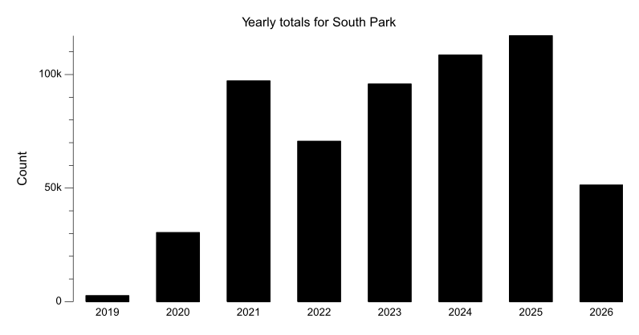
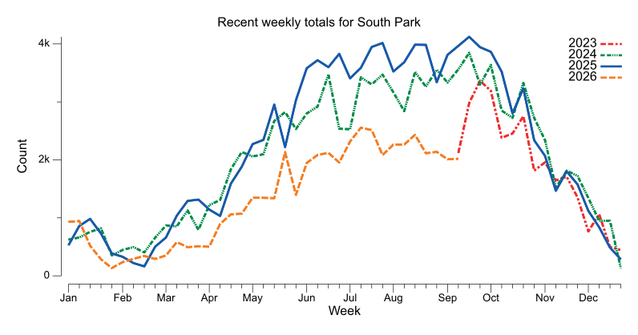
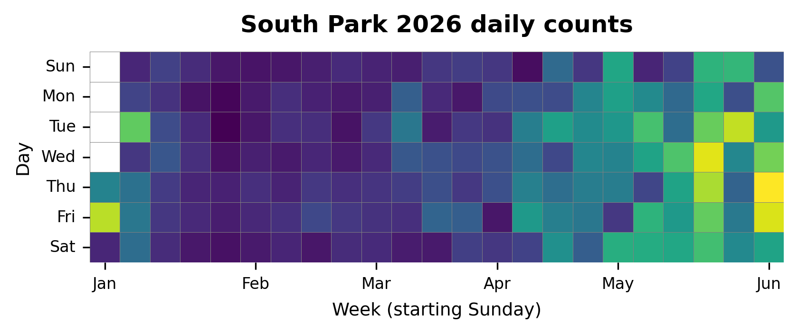

{
  "title": "South Park",
  "type": "bikehfxstats-site",
  "as_of": "2026-06-06",
  "counter_id": "south-park",
  "active": true,
  "location": "Both sides of South Park St just south of Spring Garden Rd",
  "last_seen": "2026-06-07",
  "last_non_zero_seen": "2026-01-17",
  "total_year": 18609,
  "total_all_time": 540975,
  "recent_day": {
    "label": "Jun 6",
    "count": 233
  },
  "recent_seven_days": {
    "label": "Trailing 7 days",
    "count": 1947
  },
  "month_to_date": {
    "label": "Jun to date",
    "count": 1845
  },
  "top_days": [
    {
      "label": "2025-07-22",
      "count": 723
    },
    {
      "label": "2025-06-24",
      "count": 723
    },
    {
      "label": "2024-09-05",
      "count": 720
    },
    {
      "label": "2025-09-09",
      "count": 705
    },
    {
      "label": "2025-09-17",
      "count": 703
    },
    {
      "label": "2025-09-16",
      "count": 695
    },
    {
      "label": "2025-10-07",
      "count": 690
    },
    {
      "label": "2024-09-17",
      "count": 690
    },
    {
      "label": "2025-09-04",
      "count": 689
    },
    {
      "label": "2025-08-21",
      "count": 687
    }
  ],
  "top_weeks": [
    {
      "label": "2025-09-14",
      "count": 4125
    },
    {
      "label": "2025-07-20",
      "count": 4018
    },
    {
      "label": "2025-08-17",
      "count": 3998
    },
    {
      "label": "2025-08-10",
      "count": 3993
    },
    {
      "label": "2025-09-07",
      "count": 3969
    },
    {
      "label": "2025-07-13",
      "count": 3938
    },
    {
      "label": "2025-09-21",
      "count": 3933
    },
    {
      "label": "2025-09-28",
      "count": 3869
    },
    {
      "label": "2024-09-15",
      "count": 3866
    },
    {
      "label": "2025-06-22",
      "count": 3840
    }
  ],
  "top_months": [
    {
      "label": "2025-07",
      "count": 17048
    },
    {
      "label": "2025-09",
      "count": 17037
    },
    {
      "label": "2025-08",
      "count": 16185
    },
    {
      "label": "2025-06",
      "count": 15355
    },
    {
      "label": "2024-09",
      "count": 14857
    },
    {
      "label": "2024-08",
      "count": 14469
    },
    {
      "label": "2024-07",
      "count": 14468
    },
    {
      "label": "2025-10",
      "count": 14003
    },
    {
      "label": "2024-10",
      "count": 13655
    },
    {
      "label": "2021-06",
      "count": 13599
    }
  ],
  "charts": {
    "recent_weekly": "count-by-week-recent-years.png",
    "year_heatmap": "heatmap.png",
    "yearly_totals": "count-by-year.png"
  }
}

Data through 2026-06-06.

## Summary

- Total in 2026: 18609
- Total all-time: 540975
- Active: true
- Last seen: 2026-06-07
- Last non-zero count: 2026-01-17
- Location: Both sides of South Park St just south of Spring Garden Rd

## Yearly Totals

## Recent Weekly Trend

## 2026 Daily Heatmap

## Top Days

| Day | Count |
|---|---:|
| 2025-07-22 | 723 |
| 2025-06-24 | 723 |
| 2024-09-05 | 720 |
| 2025-09-09 | 705 |
| 2025-09-17 | 703 |
| 2025-09-16 | 695 |
| 2025-10-07 | 690 |
| 2024-09-17 | 690 |
| 2025-09-04 | 689 |
| 2025-08-21 | 687 |

## Top Weeks

| Week Starting | Count |
|---|---:|
| 2025-09-14 | 4125 |
| 2025-07-20 | 4018 |
| 2025-08-17 | 3998 |
| 2025-08-10 | 3993 |
| 2025-09-07 | 3969 |
| 2025-07-13 | 3938 |
| 2025-09-21 | 3933 |
| 2025-09-28 | 3869 |
| 2024-09-15 | 3866 |
| 2025-06-22 | 3840 |

## Top Months

| Month | Count |
|---|---:|
| 2025-07 | 17048 |
| 2025-09 | 17037 |
| 2025-08 | 16185 |
| 2025-06 | 15355 |
| 2024-09 | 14857 |
| 2024-08 | 14469 |
| 2024-07 | 14468 |
| 2025-10 | 14003 |
| 2024-10 | 13655 |
| 2021-06 | 13599 |
