{
  "title": "Uni Arts",
  "type": "bikehfxstats-site",
  "as_of": "2026-07-05",
  "counter_id": "uni-arts",
  "location": "University Ave between Henry St and Seymour St",
  "last_seen": "2025-05-01",
  "last_non_zero_seen": "2025-05-01",
  "total_all_time": 185562,
  "recent_day": {
    "label": "Jul 5",
    "count": 0
  },
  "recent_seven_days": {
    "label": "Trailing 7 days",
    "count": 0
  },
  "month_to_date": {
    "label": "Jul to date",
    "count": 0
  },
  "top_days": [
    {
      "label": "2019-09-23",
      "count": 277
    },
    {
      "label": "2019-09-17",
      "count": 267
    },
    {
      "label": "2019-09-16",
      "count": 267
    },
    {
      "label": "2019-10-07",
      "count": 266
    },
    {
      "label": "2017-09-13",
      "count": 265
    },
    {
      "label": "2019-09-13",
      "count": 258
    },
    {
      "label": "2019-09-18",
      "count": 255
    },
    {
      "label": "2019-09-10",
      "count": 254
    },
    {
      "label": "2019-09-05",
      "count": 251
    },
    {
      "label": "2017-09-26",
      "count": 250
    }
  ],
  "top_weeks": [
    {
      "label": "2019-09-15",
      "count": 1396
    },
    {
      "label": "2019-09-22",
      "count": 1319
    },
    {
      "label": "2017-09-10",
      "count": 1253
    },
    {
      "label": "2018-09-16",
      "count": 1226
    },
    {
      "label": "2019-09-29",
      "count": 1197
    },
    {
      "label": "2019-09-08",
      "count": 1189
    },
    {
      "label": "2018-09-09",
      "count": 1168
    },
    {
      "label": "2017-09-17",
      "count": 1161
    },
    {
      "label": "2024-09-15",
      "count": 1140
    },
    {
      "label": "2017-09-24",
      "count": 1093
    }
  ],
  "top_months": [
    {
      "label": "2019-09",
      "count": 5245
    },
    {
      "label": "2019-10",
      "count": 4624
    },
    {
      "label": "2017-09",
      "count": 4531
    },
    {
      "label": "2018-09",
      "count": 4458
    },
    {
      "label": "2024-09",
      "count": 4017
    },
    {
      "label": "2023-09",
      "count": 3828
    },
    {
      "label": "2017-10",
      "count": 3764
    },
    {
      "label": "2024-10",
      "count": 3712
    },
    {
      "label": "2023-10",
      "count": 3532
    },
    {
      "label": "2018-10",
      "count": 3525
    }
  ],
  "year_heatmaps": [
    {
      "year": 2025,
      "filename": "heatmap-2025.png"
    },
    {
      "year": 2024,
      "filename": "heatmap-2024.png"
    },
    {
      "year": 2023,
      "filename": "heatmap-2023.png"
    },
    {
      "year": 2022,
      "filename": "heatmap-2022.png"
    },
    {
      "year": 2021,
      "filename": "heatmap-2021.png"
    },
    {
      "year": 2020,
      "filename": "heatmap-2020.png"
    },
    {
      "year": 2019,
      "filename": "heatmap-2019.png"
    },
    {
      "year": 2018,
      "filename": "heatmap-2018.png"
    },
    {
      "year": 2017,
      "filename": "heatmap-2017.png"
    }
  ],
  "charts": {
    "recent_weekly": "count-by-week-recent-years.png",
    "year_heatmap_2017": "heatmap-2017.png",
    "year_heatmap_2018": "heatmap-2018.png",
    "year_heatmap_2019": "heatmap-2019.png",
    "year_heatmap_2020": "heatmap-2020.png",
    "year_heatmap_2021": "heatmap-2021.png",
    "year_heatmap_2022": "heatmap-2022.png",
    "year_heatmap_2023": "heatmap-2023.png",
    "year_heatmap_2024": "heatmap-2024.png",
    "year_heatmap_2025": "heatmap-2025.png",
    "yearly_totals": "count-by-year.png"
  }
}

Data through 2026-07-05.

## Summary

- Total in 2026: 0
- Total all-time: 185562
- Active: false
- Last seen: 2025-05-01
- Last non-zero count: 2025-05-01
- Location: University Ave between Henry St and Seymour St

## Yearly Totals

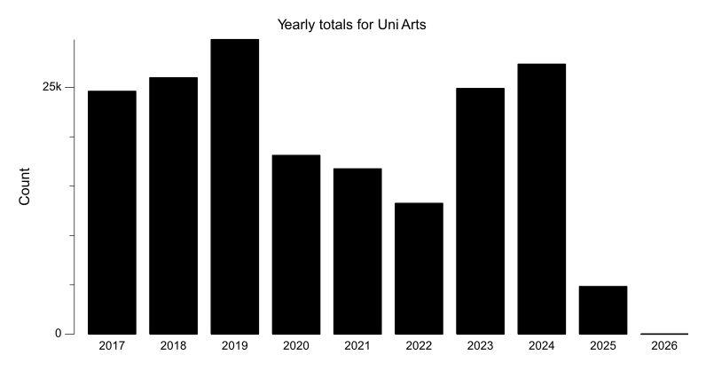

## Recent Weekly Trend

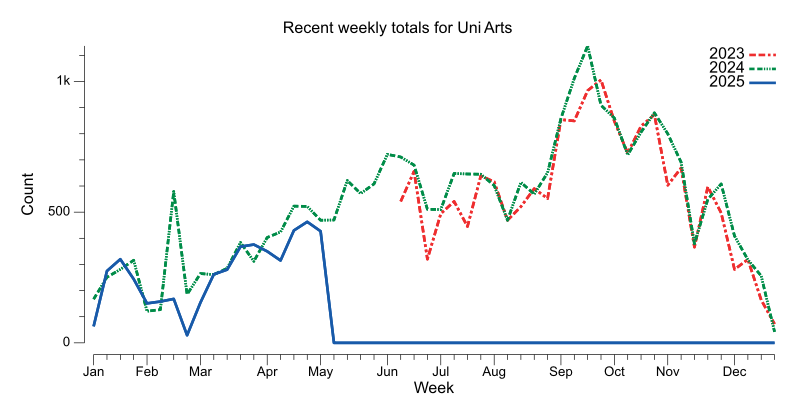

## 2025 Daily Heatmap

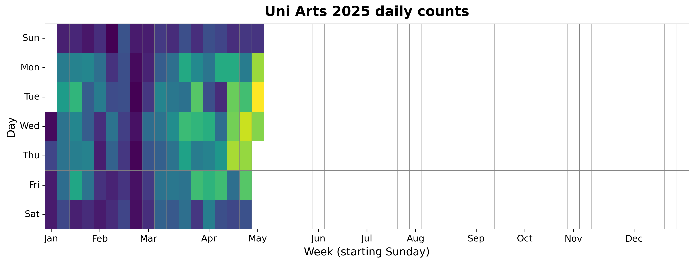

## 2024 Daily Heatmap

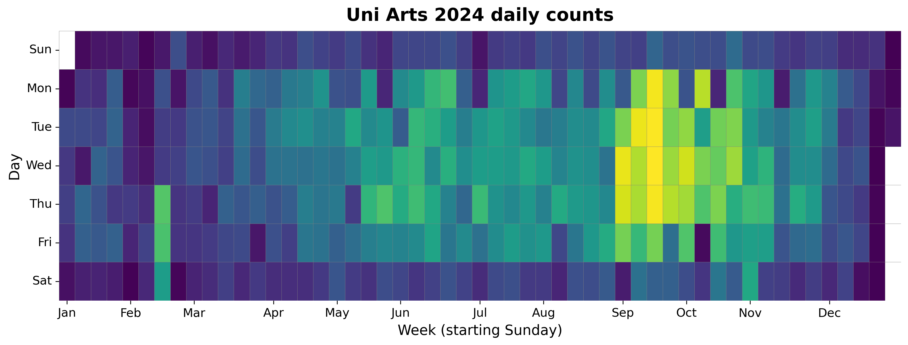

## 2023 Daily Heatmap

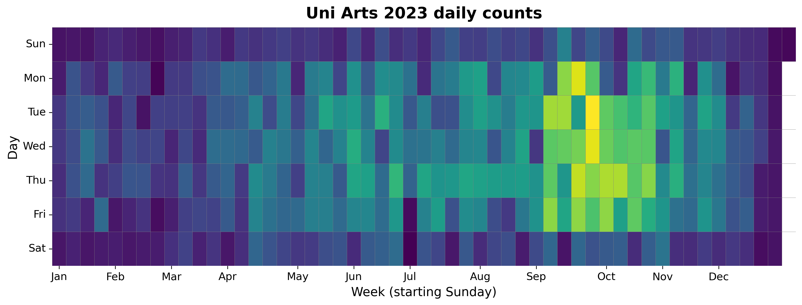

## 2022 Daily Heatmap

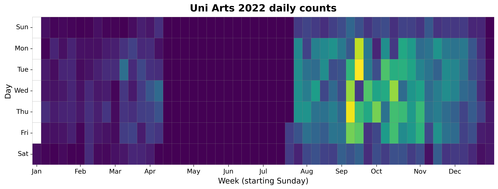

## 2021 Daily Heatmap

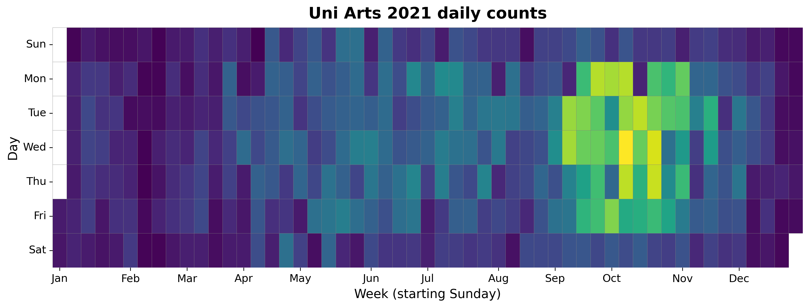

## 2020 Daily Heatmap

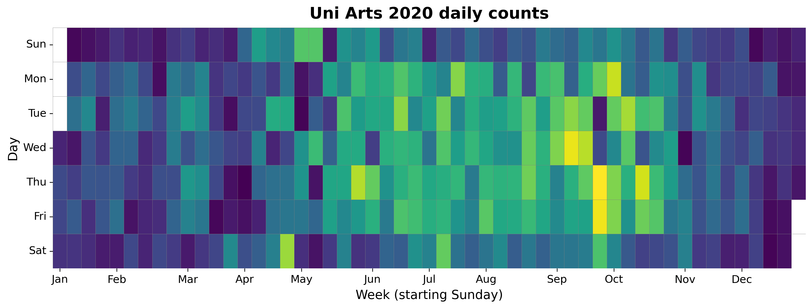

## 2019 Daily Heatmap

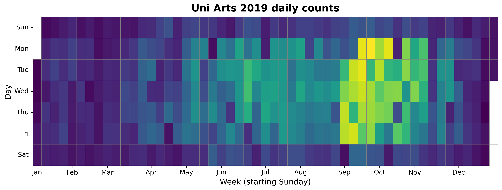

## 2018 Daily Heatmap

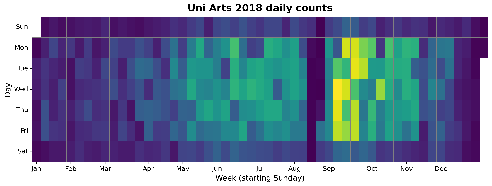

## 2017 Daily Heatmap

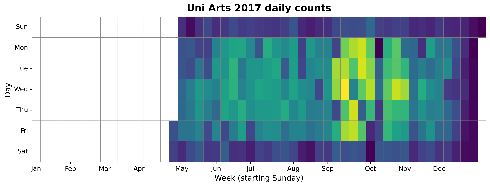

## Top Days

| Day | Count |
|---|---:|
| 2019-09-23 | 277 |
| 2019-09-17 | 267 |
| 2019-09-16 | 267 |
| 2019-10-07 | 266 |
| 2017-09-13 | 265 |
| 2019-09-13 | 258 |
| 2019-09-18 | 255 |
| 2019-09-10 | 254 |
| 2019-09-05 | 251 |
| 2017-09-26 | 250 |

## Top Weeks

| Week Starting | Count |
|---|---:|
| 2019-09-15 | 1396 |
| 2019-09-22 | 1319 |
| 2017-09-10 | 1253 |
| 2018-09-16 | 1226 |
| 2019-09-29 | 1197 |
| 2019-09-08 | 1189 |
| 2018-09-09 | 1168 |
| 2017-09-17 | 1161 |
| 2024-09-15 | 1140 |
| 2017-09-24 | 1093 |

## Top Months

| Month | Count |
|---|---:|
| 2019-09 | 5245 |
| 2019-10 | 4624 |
| 2017-09 | 4531 |
| 2018-09 | 4458 |
| 2024-09 | 4017 |
| 2023-09 | 3828 |
| 2017-10 | 3764 |
| 2024-10 | 3712 |
| 2023-10 | 3532 |
| 2018-10 | 3525 |
