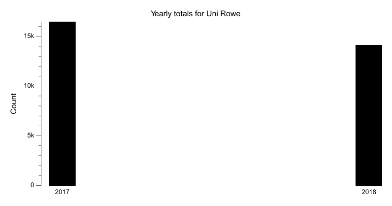
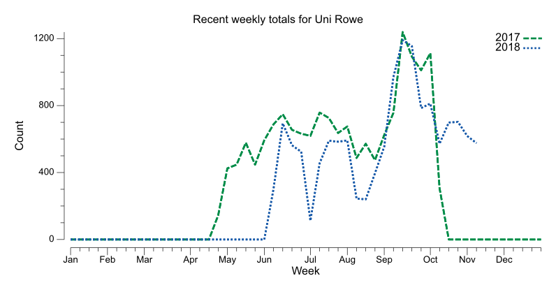
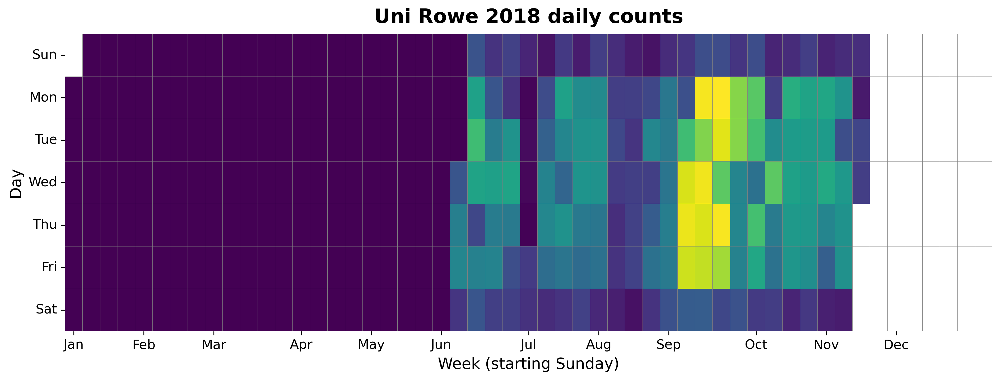
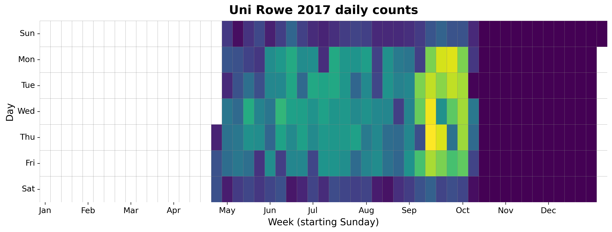

{
  "title": "Uni Rowe",
  "type": "bikehfxstats-site",
  "as_of": "2026-06-25",
  "counter_id": "uni-rowe",
  "location": "University Ave between Henry St and Seymour St",
  "last_seen": "2018-11-15",
  "last_non_zero_seen": "2018-11-15",
  "total_all_time": 30512,
  "recent_day": {
    "label": "Jun 25",
    "count": 0
  },
  "recent_seven_days": {
    "label": "Trailing 7 days",
    "count": 0
  },
  "month_to_date": {
    "label": "Jun to date",
    "count": 0
  },
  "top_days": [
    {
      "label": "2017-09-14",
      "count": 242
    },
    {
      "label": "2017-09-13",
      "count": 237
    },
    {
      "label": "2018-09-17",
      "count": 231
    },
    {
      "label": "2017-09-25",
      "count": 230
    },
    {
      "label": "2018-09-20",
      "count": 229
    },
    {
      "label": "2018-09-10",
      "count": 228
    },
    {
      "label": "2017-09-21",
      "count": 228
    },
    {
      "label": "2018-09-12",
      "count": 226
    },
    {
      "label": "2017-09-18",
      "count": 226
    },
    {
      "label": "2018-09-06",
      "count": 224
    }
  ],
  "top_weeks": [
    {
      "label": "2017-09-10",
      "count": 1239
    },
    {
      "label": "2018-09-09",
      "count": 1191
    },
    {
      "label": "2018-09-16",
      "count": 1155
    },
    {
      "label": "2017-10-01",
      "count": 1113
    },
    {
      "label": "2017-09-17",
      "count": 1092
    },
    {
      "label": "2017-09-24",
      "count": 1011
    },
    {
      "label": "2018-09-02",
      "count": 971
    },
    {
      "label": "2018-09-30",
      "count": 812
    },
    {
      "label": "2018-09-23",
      "count": 785
    },
    {
      "label": "2017-07-09",
      "count": 758
    }
  ],
  "top_months": [
    {
      "label": "2017-09",
      "count": 4264
    },
    {
      "label": "2018-09",
      "count": 4213
    },
    {
      "label": "2018-10",
      "count": 3155
    },
    {
      "label": "2017-07",
      "count": 2969
    },
    {
      "label": "2017-06",
      "count": 2921
    },
    {
      "label": "2017-08",
      "count": 2486
    },
    {
      "label": "2017-05",
      "count": 2203
    },
    {
      "label": "2018-06",
      "count": 2083
    },
    {
      "label": "2018-07",
      "count": 2012
    },
    {
      "label": "2018-08",
      "count": 1698
    }
  ],
  "year_heatmaps": [
    {
      "year": 2018,
      "filename": "heatmap-2018.png"
    },
    {
      "year": 2017,
      "filename": "heatmap-2017.png"
    }
  ],
  "charts": {
    "recent_weekly": "count-by-week-recent-years.png",
    "year_heatmap_2017": "heatmap-2017.png",
    "year_heatmap_2018": "heatmap-2018.png",
    "yearly_totals": "count-by-year.png"
  }
}

Data through 2026-06-25.

## Summary

- Total in 2026: 0
- Total all-time: 30512
- Active: false
- Last seen: 2018-11-15
- Last non-zero count: 2018-11-15
- Location: University Ave between Henry St and Seymour St

## Yearly Totals

## Recent Weekly Trend

## 2018 Daily Heatmap

## 2017 Daily Heatmap

## Top Days

| Day | Count |
|---|---:|
| 2017-09-14 | 242 |
| 2017-09-13 | 237 |
| 2018-09-17 | 231 |
| 2017-09-25 | 230 |
| 2018-09-20 | 229 |
| 2018-09-10 | 228 |
| 2017-09-21 | 228 |
| 2018-09-12 | 226 |
| 2017-09-18 | 226 |
| 2018-09-06 | 224 |

## Top Weeks

| Week Starting | Count |
|---|---:|
| 2017-09-10 | 1239 |
| 2018-09-09 | 1191 |
| 2018-09-16 | 1155 |
| 2017-10-01 | 1113 |
| 2017-09-17 | 1092 |
| 2017-09-24 | 1011 |
| 2018-09-02 | 971 |
| 2018-09-30 | 812 |
| 2018-09-23 | 785 |
| 2017-07-09 | 758 |

## Top Months

| Month | Count |
|---|---:|
| 2017-09 | 4264 |
| 2018-09 | 4213 |
| 2018-10 | 3155 |
| 2017-07 | 2969 |
| 2017-06 | 2921 |
| 2017-08 | 2486 |
| 2017-05 | 2203 |
| 2018-06 | 2083 |
| 2018-07 | 2012 |
| 2018-08 | 1698 |
