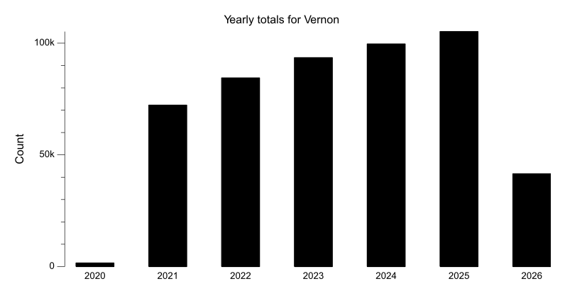
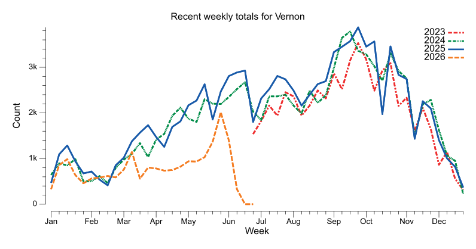
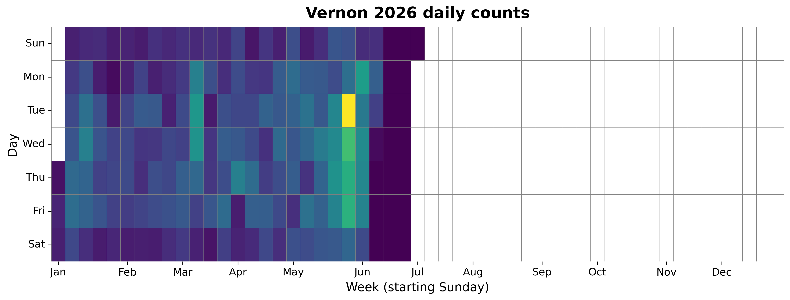
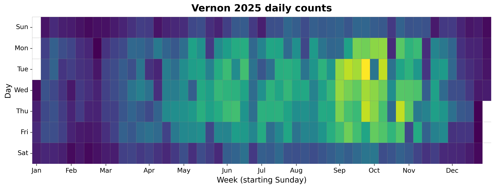
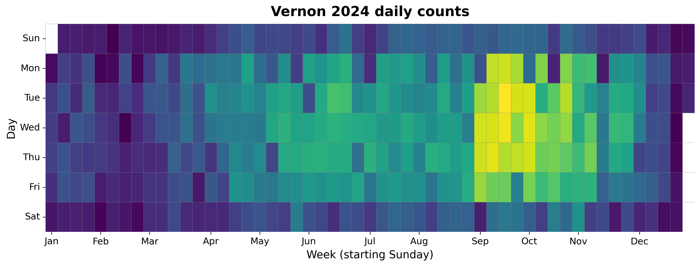
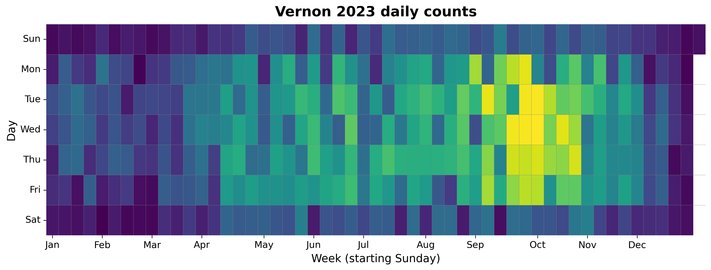
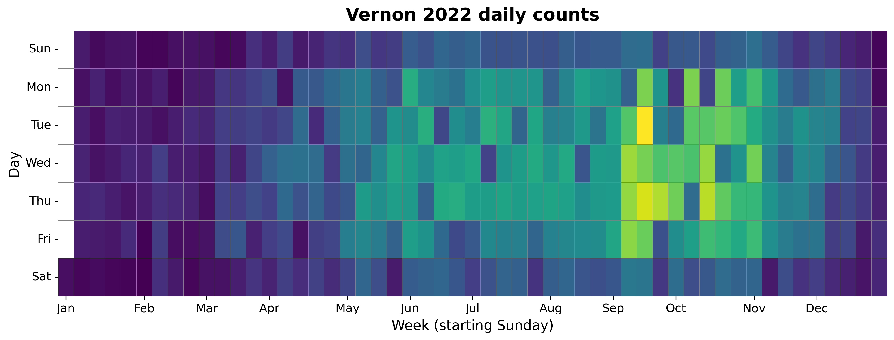
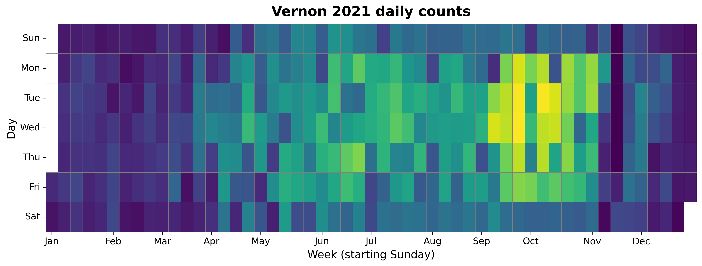
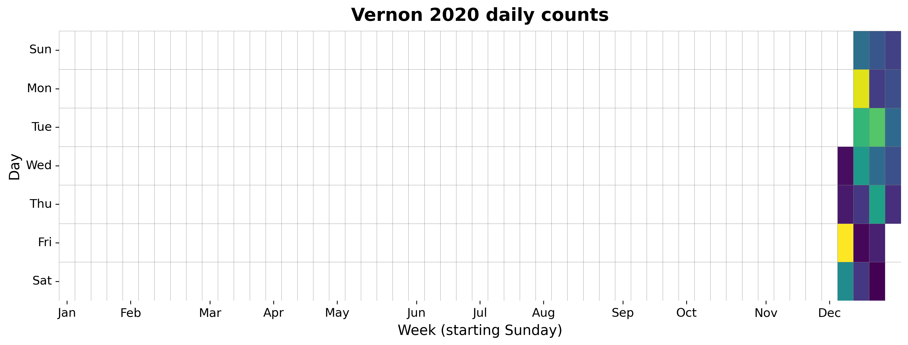

{
  "title": "Vernon",
  "type": "bikehfxstats-site",
  "as_of": "2026-06-27",
  "counter_id": "vernon",
  "active": true,
  "location": "Vernon St just north of Julibee Rd",
  "last_seen": "2026-06-02",
  "last_non_zero_seen": "2026-06-02",
  "total_year": 19782,
  "total_all_time": 476359,
  "recent_day": {
    "label": "Jun 27",
    "count": 0
  },
  "recent_seven_days": {
    "label": "Trailing 7 days",
    "count": 0
  },
  "month_to_date": {
    "label": "Jun to date",
    "count": 1665
  },
  "top_days": [
    {
      "label": "2025-09-23",
      "count": 793
    },
    {
      "label": "2025-10-07",
      "count": 721
    },
    {
      "label": "2025-09-25",
      "count": 721
    },
    {
      "label": "2025-10-23",
      "count": 720
    },
    {
      "label": "2025-09-09",
      "count": 716
    },
    {
      "label": "2024-09-17",
      "count": 712
    },
    {
      "label": "2022-09-13",
      "count": 711
    },
    {
      "label": "2024-09-18",
      "count": 693
    },
    {
      "label": "2025-09-16",
      "count": 688
    },
    {
      "label": "2025-09-24",
      "count": 684
    }
  ],
  "top_weeks": [
    {
      "label": "2025-09-21",
      "count": 3879
    },
    {
      "label": "2024-09-15",
      "count": 3776
    },
    {
      "label": "2024-09-08",
      "count": 3643
    },
    {
      "label": "2022-09-11",
      "count": 3601
    },
    {
      "label": "2025-09-14",
      "count": 3571
    },
    {
      "label": "2025-10-05",
      "count": 3567
    },
    {
      "label": "2023-09-24",
      "count": 3522
    },
    {
      "label": "2025-09-28",
      "count": 3455
    },
    {
      "label": "2025-09-07",
      "count": 3455
    },
    {
      "label": "2025-10-19",
      "count": 3452
    }
  ],
  "top_months": [
    {
      "label": "2025-09",
      "count": 15191
    },
    {
      "label": "2024-09",
      "count": 14277
    },
    {
      "label": "2024-10",
      "count": 13922
    },
    {
      "label": "2025-10",
      "count": 13831
    },
    {
      "label": "2023-10",
      "count": 12652
    },
    {
      "label": "2023-09",
      "count": 12641
    },
    {
      "label": "2022-10",
      "count": 11946
    },
    {
      "label": "2022-09",
      "count": 11942
    },
    {
      "label": "2025-07",
      "count": 11928
    },
    {
      "label": "2025-06",
      "count": 10873
    }
  ],
  "year_heatmaps": [
    {
      "year": 2026,
      "filename": "heatmap-2026.png"
    },
    {
      "year": 2025,
      "filename": "heatmap-2025.png"
    },
    {
      "year": 2024,
      "filename": "heatmap-2024.png"
    },
    {
      "year": 2023,
      "filename": "heatmap-2023.png"
    },
    {
      "year": 2022,
      "filename": "heatmap-2022.png"
    },
    {
      "year": 2021,
      "filename": "heatmap-2021.png"
    },
    {
      "year": 2020,
      "filename": "heatmap-2020.png"
    }
  ],
  "charts": {
    "recent_weekly": "count-by-week-recent-years.png",
    "year_heatmap_2020": "heatmap-2020.png",
    "year_heatmap_2021": "heatmap-2021.png",
    "year_heatmap_2022": "heatmap-2022.png",
    "year_heatmap_2023": "heatmap-2023.png",
    "year_heatmap_2024": "heatmap-2024.png",
    "year_heatmap_2025": "heatmap-2025.png",
    "year_heatmap_2026": "heatmap-2026.png",
    "yearly_totals": "count-by-year.png"
  }
}

Data through 2026-06-27.

## Summary

- Total in 2026: 19782
- Total all-time: 476359
- Active: true
- Last seen: 2026-06-02
- Last non-zero count: 2026-06-02
- Location: Vernon St just north of Julibee Rd

## Yearly Totals

## Recent Weekly Trend

## 2026 Daily Heatmap

## 2025 Daily Heatmap

## 2024 Daily Heatmap

## 2023 Daily Heatmap

## 2022 Daily Heatmap

## 2021 Daily Heatmap

## 2020 Daily Heatmap

## Top Days

| Day | Count |
|---|---:|
| 2025-09-23 | 793 |
| 2025-10-07 | 721 |
| 2025-09-25 | 721 |
| 2025-10-23 | 720 |
| 2025-09-09 | 716 |
| 2024-09-17 | 712 |
| 2022-09-13 | 711 |
| 2024-09-18 | 693 |
| 2025-09-16 | 688 |
| 2025-09-24 | 684 |

## Top Weeks

| Week Starting | Count |
|---|---:|
| 2025-09-21 | 3879 |
| 2024-09-15 | 3776 |
| 2024-09-08 | 3643 |
| 2022-09-11 | 3601 |
| 2025-09-14 | 3571 |
| 2025-10-05 | 3567 |
| 2023-09-24 | 3522 |
| 2025-09-28 | 3455 |
| 2025-09-07 | 3455 |
| 2025-10-19 | 3452 |

## Top Months

| Month | Count |
|---|---:|
| 2025-09 | 15191 |
| 2024-09 | 14277 |
| 2024-10 | 13922 |
| 2025-10 | 13831 |
| 2023-10 | 12652 |
| 2023-09 | 12641 |
| 2022-10 | 11946 |
| 2022-09 | 11942 |
| 2025-07 | 11928 |
| 2025-06 | 10873 |
