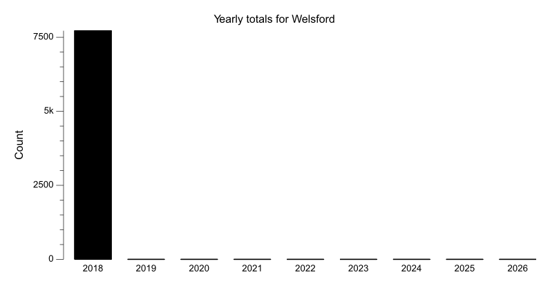
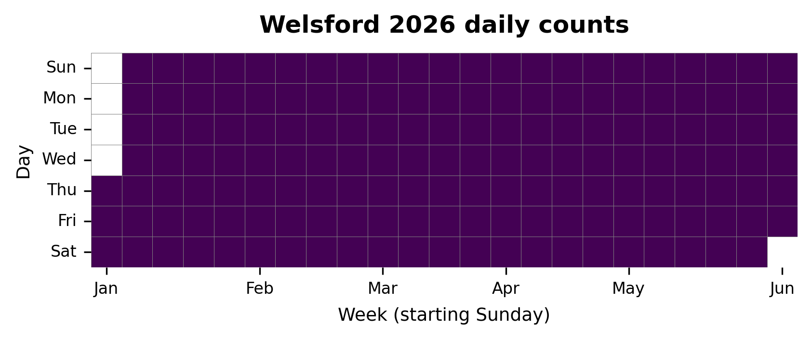

{
  "title": "Welsford",
  "type": "bikehfxstats-site",
  "as_of": "2026-06-05",
  "counter_id": "welsford",
  "location": "Commons path across from Welsford St",
  "last_seen": "2018-11-15",
  "last_non_zero_seen": "2018-11-15",
  "total_all_time": 7721,
  "recent_day": {
    "label": "Jun 5",
    "count": 0
  },
  "recent_seven_days": {
    "label": "Trailing 7 days",
    "count": 0
  },
  "month_to_date": {
    "label": "Jun to date",
    "count": 0
  },
  "top_days": [
    {
      "label": "2018-09-05",
      "count": 176
    },
    {
      "label": "2018-09-06",
      "count": 173
    },
    {
      "label": "2018-09-17",
      "count": 171
    },
    {
      "label": "2018-09-07",
      "count": 169
    },
    {
      "label": "2018-09-18",
      "count": 159
    },
    {
      "label": "2018-08-29",
      "count": 157
    },
    {
      "label": "2018-10-10",
      "count": 151
    },
    {
      "label": "2018-09-14",
      "count": 150
    },
    {
      "label": "2018-09-04",
      "count": 149
    },
    {
      "label": "2018-09-20",
      "count": 145
    }
  ],
  "top_weeks": [
    {
      "label": "2018-09-16",
      "count": 921
    },
    {
      "label": "2018-09-02",
      "count": 911
    },
    {
      "label": "2018-09-09",
      "count": 892
    },
    {
      "label": "2018-09-23",
      "count": 682
    },
    {
      "label": "2018-10-14",
      "count": 634
    },
    {
      "label": "2018-09-30",
      "count": 631
    },
    {
      "label": "2018-10-21",
      "count": 619
    },
    {
      "label": "2018-08-26",
      "count": 601
    },
    {
      "label": "2018-10-07",
      "count": 532
    },
    {
      "label": "2018-10-28",
      "count": 531
    }
  ],
  "top_months": [
    {
      "label": "2018-09",
      "count": 3582
    },
    {
      "label": "2018-10",
      "count": 2679
    },
    {
      "label": "2018-11",
      "count": 946
    },
    {
      "label": "2018-08",
      "count": 514
    }
  ],
  "charts": {
    "year_heatmap": "heatmap.png",
    "yearly_totals": "count-by-year.png"
  }
}

Data through 2026-06-05.

## Summary

- Total in 2026: 0
- Total all-time: 7721
- Active: false
- Last seen: 2018-11-15
- Last non-zero count: 2018-11-15
- Location: Commons path across from Welsford St

## Yearly Totals

## 2026 Daily Heatmap

## Top Days

| Day | Count |
|---|---:|
| 2018-09-05 | 176 |
| 2018-09-06 | 173 |
| 2018-09-17 | 171 |
| 2018-09-07 | 169 |
| 2018-09-18 | 159 |
| 2018-08-29 | 157 |
| 2018-10-10 | 151 |
| 2018-09-14 | 150 |
| 2018-09-04 | 149 |
| 2018-09-20 | 145 |

## Top Weeks

| Week Starting | Count |
|---|---:|
| 2018-09-16 | 921 |
| 2018-09-02 | 911 |
| 2018-09-09 | 892 |
| 2018-09-23 | 682 |
| 2018-10-14 | 634 |
| 2018-09-30 | 631 |
| 2018-10-21 | 619 |
| 2018-08-26 | 601 |
| 2018-10-07 | 532 |
| 2018-10-28 | 531 |

## Top Months

| Month | Count |
|---|---:|
| 2018-09 | 3582 |
| 2018-10 | 2679 |
| 2018-11 | 946 |
| 2018-08 | 514 |
