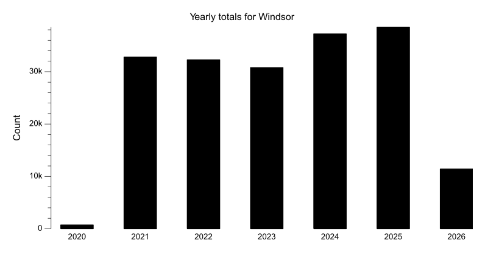
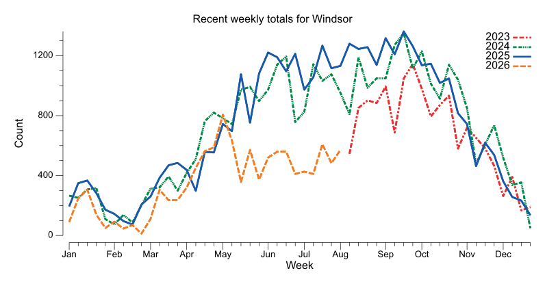
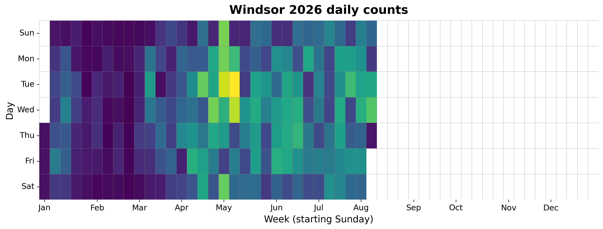
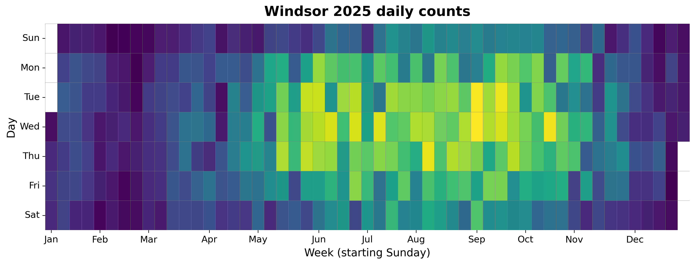
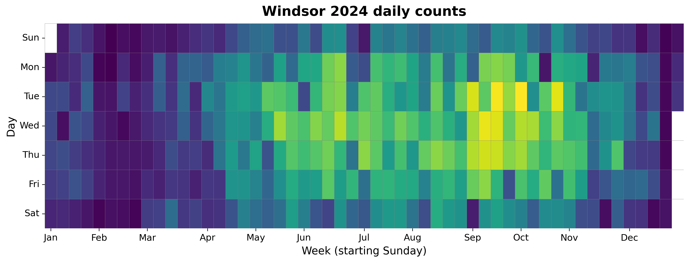
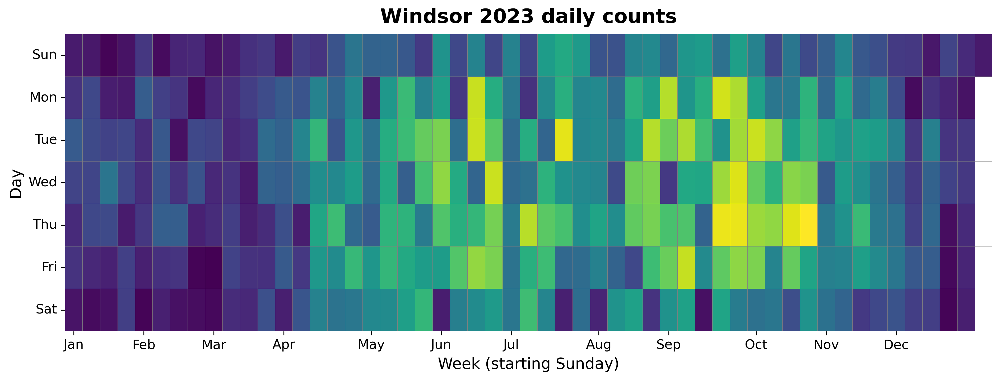
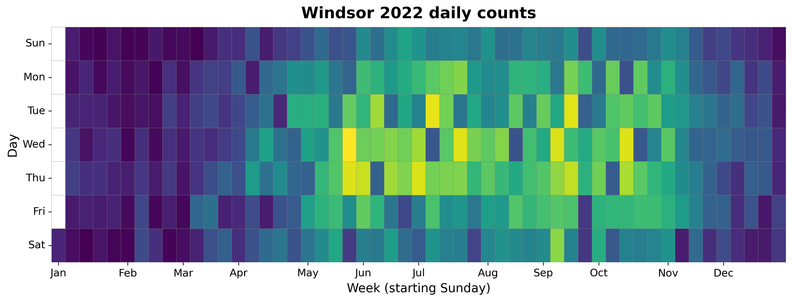
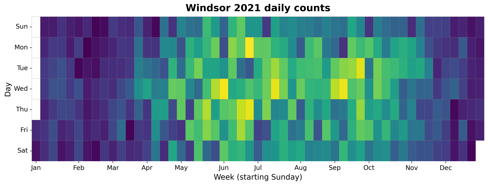
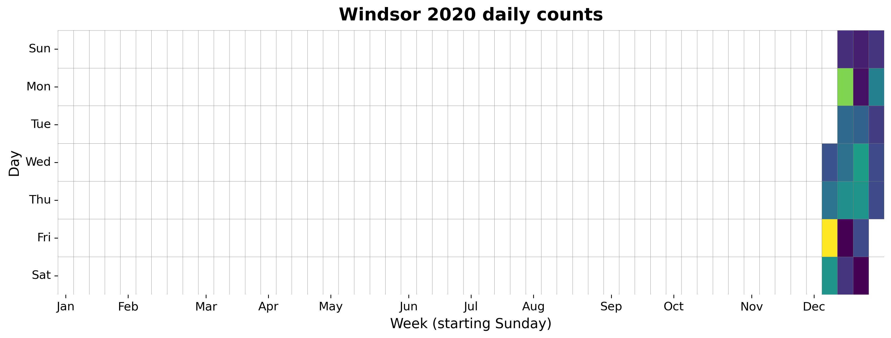

{
  "title": "Windsor",
  "type": "bikehfxstats-site",
  "as_of": "2026-08-05",
  "counter_id": "windsor",
  "active": true,
  "location": "Both sides of Windsor St just north of Edinburgh St",
  "last_seen": "2026-08-06",
  "last_non_zero_seen": "2026-05-22",
  "total_year": 11405,
  "total_all_time": 183705,
  "recent_day": {
    "label": "Aug 5",
    "count": 130
  },
  "recent_seven_days": {
    "label": "Trailing 7 days",
    "count": 516
  },
  "month_to_date": {
    "label": "Aug to date",
    "count": 380
  },
  "top_days": [
    {
      "label": "2025-09-03",
      "count": 261
    },
    {
      "label": "2025-09-02",
      "count": 257
    },
    {
      "label": "2025-10-15",
      "count": 255
    },
    {
      "label": "2025-09-16",
      "count": 253
    },
    {
      "label": "2025-08-07",
      "count": 251
    },
    {
      "label": "2024-10-01",
      "count": 251
    },
    {
      "label": "2024-09-17",
      "count": 248
    },
    {
      "label": "2025-07-09",
      "count": 247
    },
    {
      "label": "2025-06-25",
      "count": 245
    },
    {
      "label": "2025-06-11",
      "count": 245
    }
  ],
  "top_weeks": [
    {
      "label": "2025-09-14",
      "count": 1363
    },
    {
      "label": "2024-09-15",
      "count": 1347
    },
    {
      "label": "2025-08-31",
      "count": 1306
    },
    {
      "label": "2025-08-03",
      "count": 1275
    },
    {
      "label": "2024-09-08",
      "count": 1271
    },
    {
      "label": "2025-09-21",
      "count": 1262
    },
    {
      "label": "2025-08-17",
      "count": 1260
    },
    {
      "label": "2025-07-13",
      "count": 1258
    },
    {
      "label": "2025-08-10",
      "count": 1241
    },
    {
      "label": "2024-09-29",
      "count": 1238
    }
  ],
  "top_months": [
    {
      "label": "2025-09",
      "count": 5461
    },
    {
      "label": "2025-08",
      "count": 5280
    },
    {
      "label": "2025-07",
      "count": 5136
    },
    {
      "label": "2024-09",
      "count": 5038
    },
    {
      "label": "2025-06",
      "count": 4890
    },
    {
      "label": "2024-10",
      "count": 4797
    },
    {
      "label": "2025-10",
      "count": 4676
    },
    {
      "label": "2021-06",
      "count": 4676
    },
    {
      "label": "2024-07",
      "count": 4630
    },
    {
      "label": "2024-08",
      "count": 4412
    }
  ],
  "year_heatmaps": [
    {
      "year": 2026,
      "filename": "heatmap-2026.png"
    },
    {
      "year": 2025,
      "filename": "heatmap-2025.png"
    },
    {
      "year": 2024,
      "filename": "heatmap-2024.png"
    },
    {
      "year": 2023,
      "filename": "heatmap-2023.png"
    },
    {
      "year": 2022,
      "filename": "heatmap-2022.png"
    },
    {
      "year": 2021,
      "filename": "heatmap-2021.png"
    },
    {
      "year": 2020,
      "filename": "heatmap-2020.png"
    }
  ],
  "charts": {
    "recent_weekly": "count-by-week-recent-years.png",
    "year_heatmap_2020": "heatmap-2020.png",
    "year_heatmap_2021": "heatmap-2021.png",
    "year_heatmap_2022": "heatmap-2022.png",
    "year_heatmap_2023": "heatmap-2023.png",
    "year_heatmap_2024": "heatmap-2024.png",
    "year_heatmap_2025": "heatmap-2025.png",
    "year_heatmap_2026": "heatmap-2026.png",
    "yearly_totals": "count-by-year.png"
  }
}

Data through 2026-08-05.

## Summary

- Total in 2026: 11405
- Total all-time: 183705
- Active: true
- Last seen: 2026-08-06
- Last non-zero count: 2026-05-22
- Location: Both sides of Windsor St just north of Edinburgh St

## Yearly Totals

## Recent Weekly Trend

## 2026 Daily Heatmap

## 2025 Daily Heatmap

## 2024 Daily Heatmap

## 2023 Daily Heatmap

## 2022 Daily Heatmap

## 2021 Daily Heatmap

## 2020 Daily Heatmap

## Top Days

| Day | Count |
|---|---:|
| 2025-09-03 | 261 |
| 2025-09-02 | 257 |
| 2025-10-15 | 255 |
| 2025-09-16 | 253 |
| 2025-08-07 | 251 |
| 2024-10-01 | 251 |
| 2024-09-17 | 248 |
| 2025-07-09 | 247 |
| 2025-06-25 | 245 |
| 2025-06-11 | 245 |

## Top Weeks

| Week Starting | Count |
|---|---:|
| 2025-09-14 | 1363 |
| 2024-09-15 | 1347 |
| 2025-08-31 | 1306 |
| 2025-08-03 | 1275 |
| 2024-09-08 | 1271 |
| 2025-09-21 | 1262 |
| 2025-08-17 | 1260 |
| 2025-07-13 | 1258 |
| 2025-08-10 | 1241 |
| 2024-09-29 | 1238 |

## Top Months

| Month | Count |
|---|---:|
| 2025-09 | 5461 |
| 2025-08 | 5280 |
| 2025-07 | 5136 |
| 2024-09 | 5038 |
| 2025-06 | 4890 |
| 2024-10 | 4797 |
| 2025-10 | 4676 |
| 2021-06 | 4676 |
| 2024-07 | 4630 |
| 2024-08 | 4412 |
